# Active Directory Attack & Detection Lab — Final Project Case Study

> **Detection Engineering Portfolio Project**  
> Windows Server 2022 • Active Directory • Windows 11 • Kali Linux • Sysmon • Wazuh SIEM • Sigma • PowerShell

---

## Executive Summary

This project is an end-to-end **Active Directory Attack & Detection Engineering Lab** built in Oracle VirtualBox.

The objective was not simply to reproduce attack techniques. The project was designed around the complete defensive lifecycle:

**Build → Generate Activity → Observe → Ingest → Detect → Investigate → Tune → Validate → Harden → Retest → Document**

The environment was used to generate controlled security events involving:

- Network and Active Directory reconnaissance
- Password spraying and failed authentication
- Kerberoasting
- PowerShell Active Directory reconnaissance
- Remote administrative logons
- Privileged-group membership changes
- Authentication attempts against a canary identity
- Active Directory object auditing with Event ID 4662
- LDAP diagnostic visibility with Event ID 1644
- Benign enterprise-like background traffic

The project then extended those scenarios into a detection-engineering portfolio by adding:

- Windows Advanced Audit Policy
- PowerShell Script Block Logging
- Sysmon
- Wazuh endpoint agents and centralized event analysis
- Custom Wazuh XML detections
- Sigma detection-as-code
- Repeatable Wazuh hunting views
- False-positive testing using benign background traffic
- Detection validation documentation
- Hardening and post-hardening retesting
- Evidence-driven reporting

The final result is a lab that demonstrates not only how attack-like behavior is generated, but also how defenders observe, detect, investigate, tune, validate, and remediate it.

---

# 1. Authorization and Scope

All testing in this project was performed against deliberately created systems inside a private VirtualBox environment.

## Lab Network

```text
Network: AD-LAB
Subnet: 10.10.10.0/24
```

No production systems, real organizations, public infrastructure, or real credentials were targeted.

The project intentionally excluded destructive or unnecessarily high-risk techniques such as:

- LSASS credential dumping
- DCSync
- Golden Ticket attacks
- Silver Ticket attacks
- Ransomware
- Destructive payloads
- Persistence against real systems
- Evasion against real security controls

The objective remained defensive detection engineering throughout the project.

---

# 2. Lab Architecture

## Systems

| System | Role | IP Address |
|---|---|---:|
| `DC01` | Windows Server 2022 / Domain Controller / DNS | `10.10.10.10` |
| `WIN11-CLIENT` | Windows 11 Pro domain workstation | `10.10.10.20` |
| `WAZUH` | Wazuh Manager / Indexer / Dashboard | `10.10.10.30` |
| `KALI` | Controlled testing workstation | `10.10.10.50` |

## Active Directory

```text
DNS Domain: adlab.test
NetBIOS Domain: ADLAB
Domain Controller: DC01
```

## Architecture Diagram


## Detailed Detection Architecture

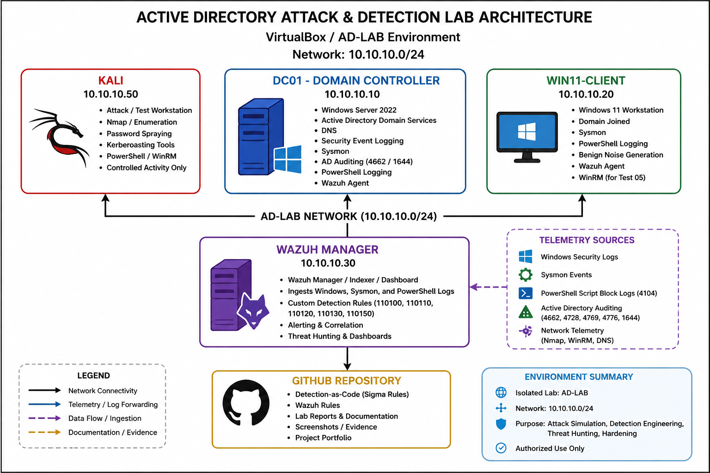

## Network Design

The Active Directory test environment remained isolated on the internal `AD-LAB` network.

The Wazuh server used additional management connectivity where necessary for:

- Dashboard access
- SSH administration
- Package and update access

The Windows domain systems were kept separated from normal production or public environments.

---

# 3. Repository Structure

```text
active-directory-attack-detection-lab/
│
├── README.md
├── FINAL.md
├── .gitignore
│
├── diagrams/
│   ├── architecture.png
│   └── architecture-detailed.png
│
├── automation/
│   ├── benign-noise.ps1
│   └── scheduled-task-setup.ps1
│
├── configs/
│   ├── sysmon/
│   │   └── sysmon-config.xml
│   │
│   ├── windows-auditing/
│   │   ├── advanced-audit-policy.md
│   │   ├── directory-service-sacl.md
│   │   ├── powershell-logging.md
│   │   └── ldap-1644.md
│   │
│   └── wazuh/
│       └── agent-log-channels.md
│
├── detections/
│   ├── wazuh/
│   │   └── local_rules.xml
│   │
│   └── sigma/
│       ├── kerberoasting.yml
│       ├── powershell-ad-recon.yml
│       └── privileged-group-change.yml
│
├── dashboards/
│   └── wazuh-saved-searches.md
│
├── reports/
│   ├── test-01-reconnaissance.md
│   ├── test-02-password-spray.md
│   ├── test-03-kerberoasting.md
│   ├── test-04-powershell.md
│   ├── test-05-lateral-movement.md
│   ├── test-06-privilege-change.md
│   ├── detection-validation-matrix.md
│   ├── noise-baseline.md
│   └── final-summary.md
│
├── screenshots/
│   └── project evidence
│
└── docs/
    └── final-project-report.pdf
```

The PDF report is intentionally produced after the Markdown case study and final repository review.

---

# 4. Project Status

| Component | Status |
|---|---|
| Active Directory domain | ✅ Complete |
| Windows 11 domain join | ✅ Complete |
| Advanced Windows auditing | ✅ Complete |
| PowerShell Script Block Logging | ✅ Complete |
| Sysmon | ✅ Complete |
| Wazuh deployment | ✅ Complete |
| Windows agent enrollment | ✅ Complete |
| Network reconnaissance scenario | ✅ Complete |
| Password-spray scenario | ✅ Complete |
| Kerberoasting scenario | ✅ Complete |
| PowerShell reconnaissance scenario | ✅ Complete |
| Remote administrative logon scenario | ✅ Complete |
| Privileged-group change scenario | ✅ Complete |
| Canary identity | ✅ Complete |
| Event ID 4662 targeted auditing | ✅ Complete |
| LDAP Event ID 1644 | 🟡 Local telemetry validated; Wazuh ingestion gap |
| Custom Wazuh rules | ✅ Complete |
| Sigma detection-as-code | ✅ Complete |
| Wazuh hunting views | ✅ Complete |
| Benign-noise automation | ✅ Complete |
| False-positive validation | ✅ Complete |
| Detection validation matrix | ✅ Complete |
| Hardening | ✅ Complete |
| Post-hardening retest | ✅ Complete |

---

# 5. Day 1 — Domain Controller Deployment

## Windows Server 2022

The first stage established `DC01`, the core identity system for the lab.

The server was configured with:

```text
Hostname: DC01
IP Address: 10.10.10.10
Subnet: 10.10.10.0/24
DNS: 10.10.10.10
```

Active Directory Domain Services and DNS were installed, and a new forest was created:

```text
adlab.test
```

The server was promoted to Domain Controller.

## Day 1 Evidence

### VirtualBox AD-LAB Network


### DC01 IP Address and Hostname


### Active Directory Domain Services Installed

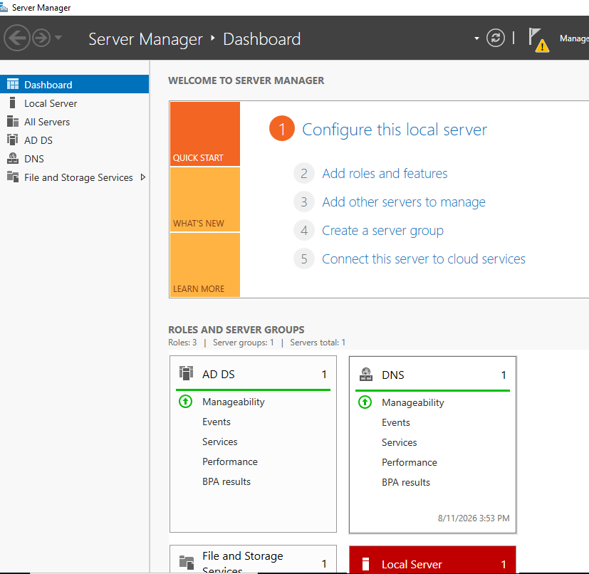

### Domain Controller Validation


---

# 6. Day 2 — Active Directory Structure and Workstation

## Organizational Units

Dedicated Organizational Units were used instead of placing all objects in default containers.

The structure included logical areas for:

```text
Lab Users
Service Accounts
Workstations
Servers
Groups
```

This allowed Group Policy and auditing configuration to be scoped more cleanly.

### OU Structure


## Lab Identities

The environment included controlled identities for normal activity and detection scenarios.

| Account | Purpose |
|---|---|
| `alice.user` | Normal domain user |
| `bob.user` | Secondary normal domain user |
| `helpdesk.test` | Helpdesk / privilege-change testing |
| `svc_web` | Kerberos service account |
| `canary.admin` | Disabled high-signal tripwire account |

Passwords were lab-only and were not stored in the repository.

## Kerberos Service Account

The service account used for the Kerberoasting scenario was:

```text
svc_web
```

The configured Service Principal Name was:

```text
HTTP/web.adlab.test
```

### SPN Validation


## Windows 11 Workstation

The Windows 11 client was configured as:

```text
Hostname: WIN11-CLIENT
IP Address: 10.10.10.20
DNS Server: 10.10.10.10
```

It was successfully joined to the `adlab.test` domain.

### Domain Join


### Domain User Login


### Workstation OU


---

# 7. Day 3 — Windows Security Auditing

A dedicated auditing baseline was created for the Domain Controller.

Important categories included:

- Account Logon
- Logon / Logoff
- Account Management
- Process Creation
- Directory Service Access
- Kerberos Authentication Service
- Kerberos Service Ticket Operations
- Credential Validation

## Important Windows Security Event IDs

| Event ID | Security Meaning |
|---:|---|
| `4624` | Successful logon |
| `4625` | Failed logon |
| `4648` | Explicit credential use |
| `4662` | Active Directory object access |
| `4672` | Special privileges assigned |
| `4688` | New process created |
| `4728` | Member added to global security group |
| `4732` | Member added to local security group |
| `4756` | Member added to universal security group |
| `4768` | Kerberos TGT requested |
| `4769` | Kerberos service ticket requested |
| `4771` | Kerberos pre-authentication failure |
| `4776` | Credential validation |
| `5136` | Directory service object modification |
| `5140/5145` | SMB/share activity |

## Audit Policy Evidence

### Advanced Audit Policy — View 1


### Advanced Audit Policy — View 2


### DC01 GPO Result


---

# 8. PowerShell Logging

PowerShell Script Block Logging was enabled to provide visibility into executed PowerShell content.

The main event used during the project was:

```text
Event ID 4104
```

PowerShell itself was not treated as malicious. Detection decisions were based on:

- User
- Host
- Script content
- Command type
- Frequency
- Breadth of enumeration
- Surrounding security activity

## PowerShell Evidence

### Test Command


### Event ID 4104


### WIN11 Script Block Logging


### Workstation Logging GPO


### Encoded PowerShell Validation Command


---

# 9. Sysmon Deployment

Sysmon was installed to provide endpoint telemetry beyond native Windows Security auditing.

Important Sysmon events included:

| Sysmon ID | Purpose |
|---:|---|
| `1` | Process creation |
| `3` | Network connection |
| `11` | File creation |
| `22` | DNS query |

## DC01 Sysmon Evidence

### Sysmon Configuration Validation


### Process Creation Event


## WIN11 Sysmon Evidence

### Sysmon Service Running


### Process Creation


### DNS Query


---

# 10. Wazuh SIEM Deployment

Wazuh was used as the central analysis platform for Windows and Sysmon telemetry.

The environment included:

- Wazuh Manager
- Wazuh Indexer
- Wazuh Dashboard
- Wazuh Agent on DC01
- Wazuh Agent on WIN11-CLIENT

## Connectivity and Deployment Evidence

### Wazuh Networking

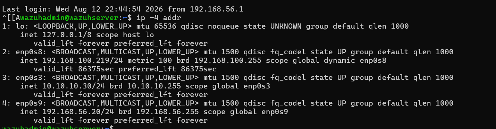

### AD-LAB Connectivity

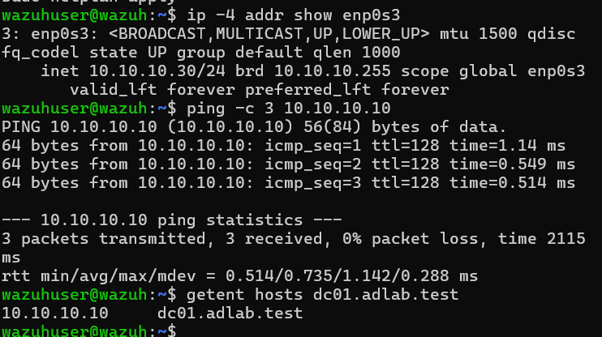

### Dashboard


### DC01 Agent Deployment


### DC01 Agent Running


### DC01 Agent Active


### Agent Status


### All Agents Active


---

# 11. Detection Scenario 01 — Network Reconnaissance

## Objective

Simulate controlled internal reconnaissance against DC01 and determine whether repeated network-service enumeration could be detected.

## Controlled Activity

Example:

```bash
nmap -sV -Pn 10.10.10.10
```

The target remained inside the isolated AD-LAB network.

## Detection

Custom Wazuh rule:

```text
Rule ID: 110130
Purpose: Network service discovery / reconnaissance
Correlation: frequency-based
```

The rule used repeated network behavior within a short timeframe instead of treating every single network connection as malicious.

## Result

**✅ Detected**

The detection was also evaluated while benign workstation activity was active.

No observed benign WIN11-CLIENT activity triggered the tuned reconnaissance detection during the validation window.

## Reconnaissance Evidence

### Kali DNS / Route Configuration

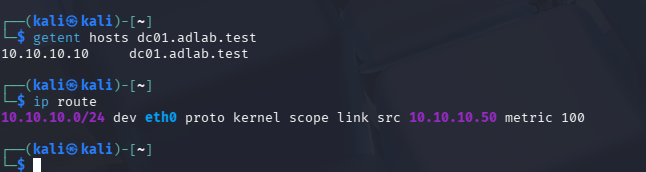

### Kali → DC01 Connectivity

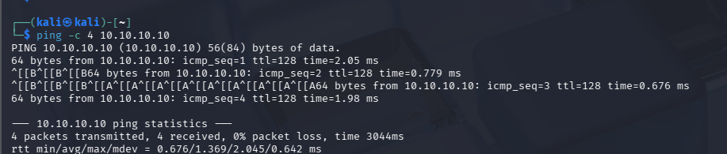

### Service Reconnaissance

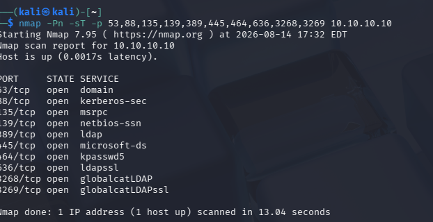

### Multi-Port Reconnaissance Seen on DC01

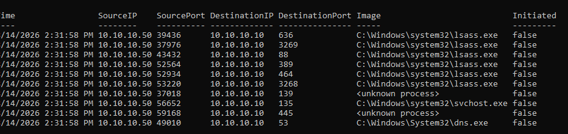

### Sysmon Reconnaissance Telemetry

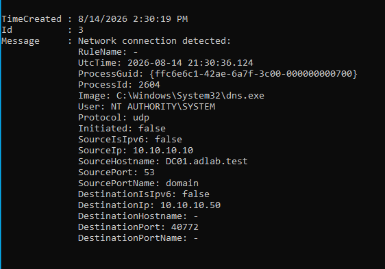

### Wazuh Reconnaissance Telemetry

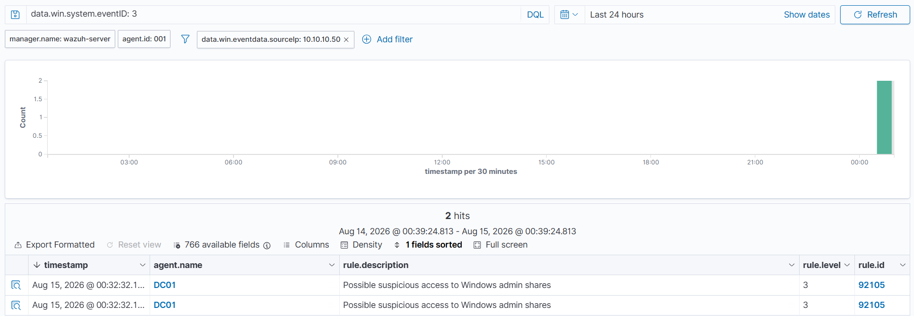

### Network-Service Scan Dashboard Alert

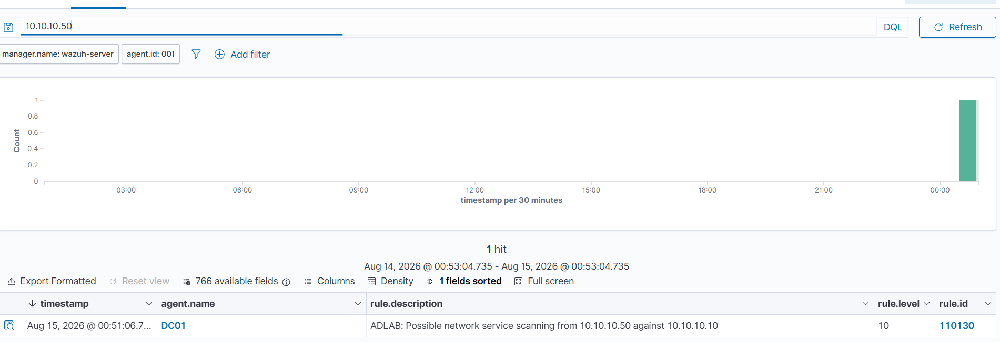

### False-Positive Check

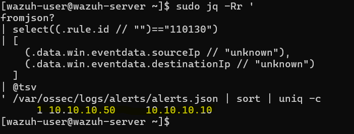

### Tuned Detection

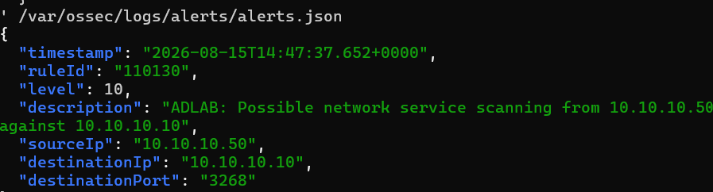

### Benign False-Positive Validation

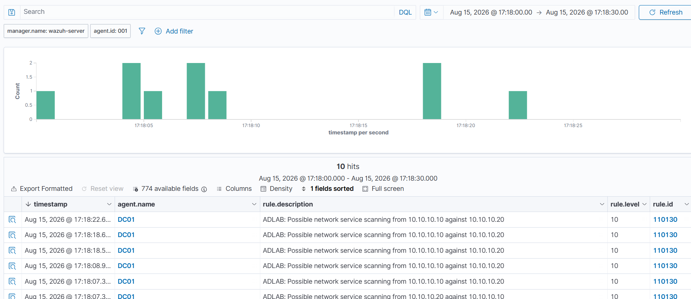

Full test report:

[`reports/test-01-reconnaissance.md`](reports/test-01-reconnaissance.md)

---

# 12. Detection Scenario 02 — Password Spraying / Failed Authentication

## Objective

Generate a small controlled cluster of failed authentication attempts against dummy AD accounts while remaining below account-lockout thresholds.

## Relevant Events

```text
4625 — Failed logon
4771 — Kerberos pre-authentication failure
4776 — Credential validation
```

## Detection

Custom Wazuh rule:

```text
Rule ID: 110110
Frequency: 4
Timeframe: 120 seconds
```

Frequency correlation was used to distinguish repeated authentication failures from normal isolated password mistakes.

## Result

**✅ Detected**

No unintended account lockout was caused.

## Evidence

### Wazuh Failed Logon Detection


### Password Spray Dashboard Alert


### Authentication Hunting View

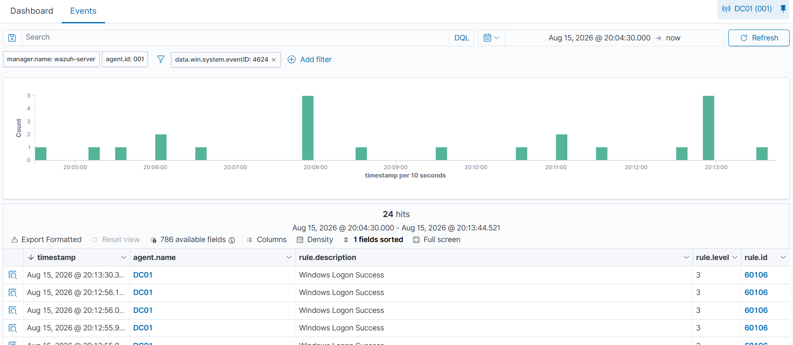

Full test report:

[`reports/test-02-password-spray.md`](reports/test-02-password-spray.md)

---

# 13. Detection Scenario 03 — Kerberoasting

## Objective

Generate a controlled Kerberos service-ticket request against the deliberately configured `svc_web` account.

## Service Account

```text
Account: svc_web
SPN: HTTP/web.adlab.test
```

## Relevant Event

```text
4769 — A Kerberos service ticket was requested
```

## Detection

Custom Wazuh rule:

```text
Rule ID: 110100
Purpose: Kerberoasting detection
```

The investigation considered:

- Requesting account
- Service name
- Service account
- Source system
- Ticket encryption information
- SPN
- Timestamp

Normal Event 4769 activity was also observed. This was an important finding because it demonstrated that defenders should not alert on every service-ticket request without context.

## Result

**✅ Detected**

After testing, the deliberately weak lab-only password on `svc_web` was replaced with a strong unique password.

## Evidence

### Kerberos Service Ticket


### Event 4769 / RC4 Evidence


### Kerberoasting Rule Logtest Evidence


### Kerberoasting Live Detection


### Kerberoasting Dashboard Alert


### Kerberos Hunting View

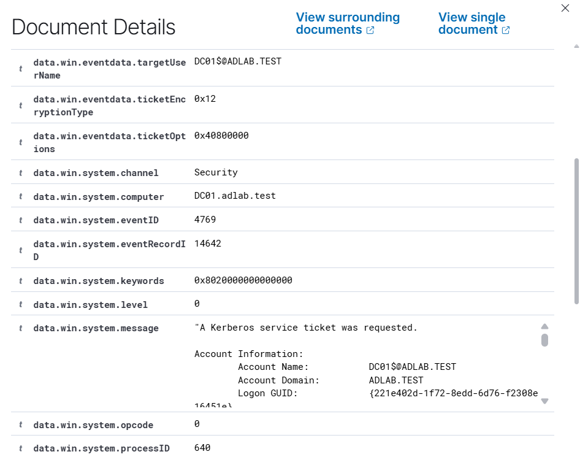

Full test report:

[`reports/test-03-kerberoasting.md`](reports/test-03-kerberoasting.md)

---

# 14. Detection Scenario 04 — Suspicious PowerShell AD Reconnaissance

## Objective

Generate controlled Active Directory enumeration through PowerShell and detect suspicious discovery behavior without classifying all PowerShell use as malicious.

## Controlled Commands

Examples:

```powershell
Get-ADDomain
Get-ADUser -Filter *
Get-ADGroup -Filter *
Get-ADGroupMember "Domain Admins"
```

## Detection

Custom Wazuh rule:

```text
Rule ID: 110120
```

The detection focused on Active Directory reconnaissance keywords and context.

## Relevant Telemetry

- PowerShell Event ID `4104`
- Sysmon Event ID `1`
- Windows process-creation telemetry where available

## Result

**✅ Detected**

## Evidence

### Suspicious PowerShell Dashboard Alert


### Encoded PowerShell Dashboard Alert


### PowerShell Hunting View

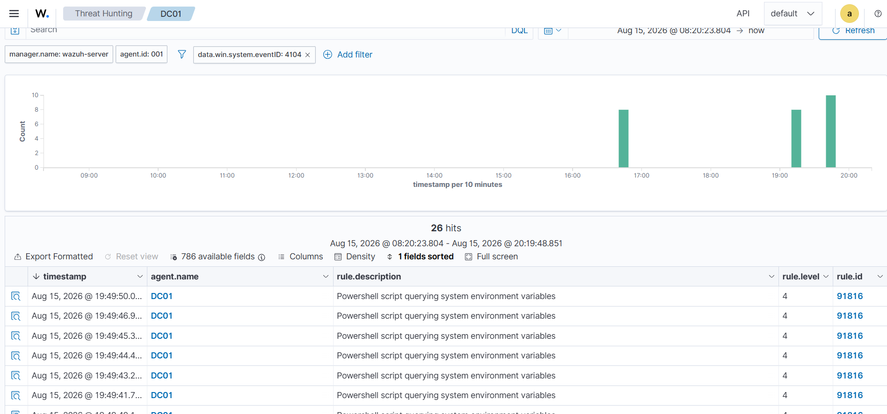

Full test report:

[`reports/test-04-powershell.md`](reports/test-04-powershell.md)

---

# 15. Detection Scenario 05 — Controlled Remote Administrative Logon

## Objective

Generate a remote administrative authentication event from WIN11-CLIENT to DC01 using PowerShell Remoting / WinRM.

## Source

```text
WIN11-CLIENT
10.10.10.20
```

## Destination

```text
DC01
10.10.10.10
```

## Observed Windows Event

```text
Event ID: 4624
Logon Type: 3
Account: Administrator
Source IP: 10.10.10.20
Authentication Package: Kerberos
```

## Result

**🟡 Logged but not alerted**

The expected raw Windows event was observed on DC01.

However, the exact Type-3 remote administrative event was not confirmed as a corresponding dedicated Wazuh alert.

This is intentionally documented as a detection gap rather than being overstated.

## Evidence

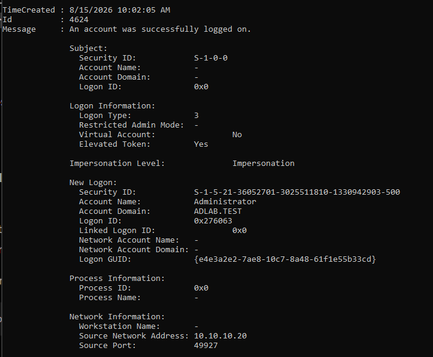

Full test report:

[`reports/test-05-lateral-movement.md`](reports/test-05-lateral-movement.md)

---

# 16. Detection Scenario 06 — Privileged Group Membership Change

## Objective

Test whether a high-risk Active Directory privilege change could be detected.

The controlled test temporarily added:

```text
helpdesk.test
```

to:

```text
Domain Admins
```

## Windows Event

```text
4728 — Member added to a security-enabled global group
```

## Wazuh Result

```text
Rule ID: 60159
Description: Domain Admins Group Changed
Level: 12
```

## Result

**✅ Detected**

After evidence was collected, `helpdesk.test` was immediately removed from Domain Admins.

## Evidence

### Windows Event 4728

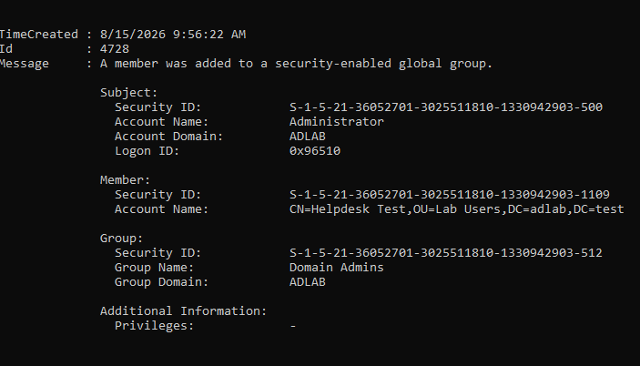

### Wazuh Group Change

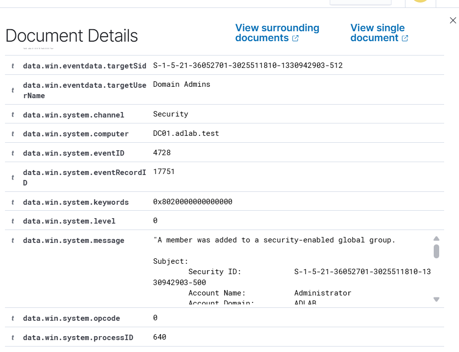

### Wazuh Rule 60159

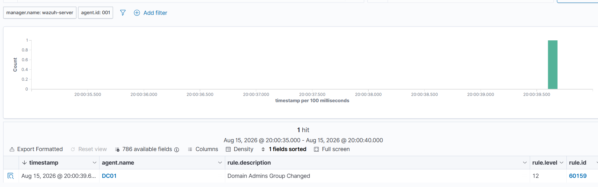

### Privilege-Change Hunting View

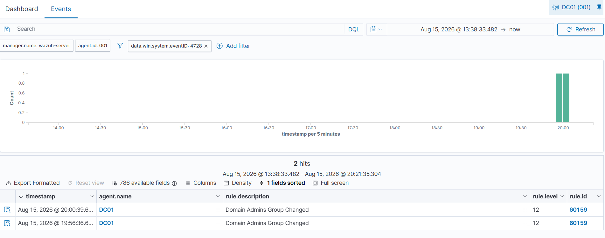

Full test report:

[`reports/test-06-privilege-change.md`](reports/test-06-privilege-change.md)

---

# 17. Canary Identity Tripwire

A dedicated canary identity was configured:

```text
canary.admin
```

The account was intentionally:

- Disabled
- Non-privileged
- Not used for normal administration
- Reserved as a detection tripwire

A controlled authentication attempt was generated from WIN11-CLIENT.

## Observed Event

```text
Event ID: 4776
Target Account: canary.admin
Source Workstation: WIN11-CLIENT
```

## Custom Detection

```text
Rule ID: 110150
Severity Level: 12
MITRE ATT&CK: T1078
```

Because the account is never expected to authenticate legitimately, attempts involving this identity have very high detection value.

## Result

**✅ Detected**

The rule was also revalidated after hardening.

## Evidence

### Canary Account Disabled

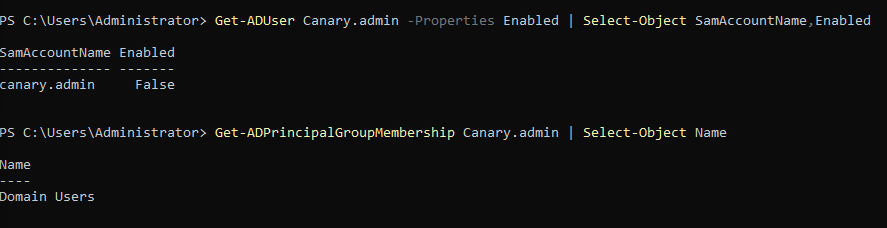

### Controlled Canary Attempt

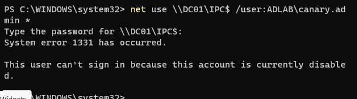

### Event ID 4776


### Wazuh 4776 Event

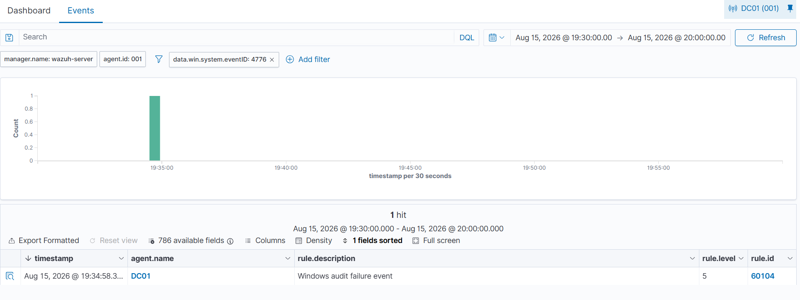

### Decoded Canary Event Details

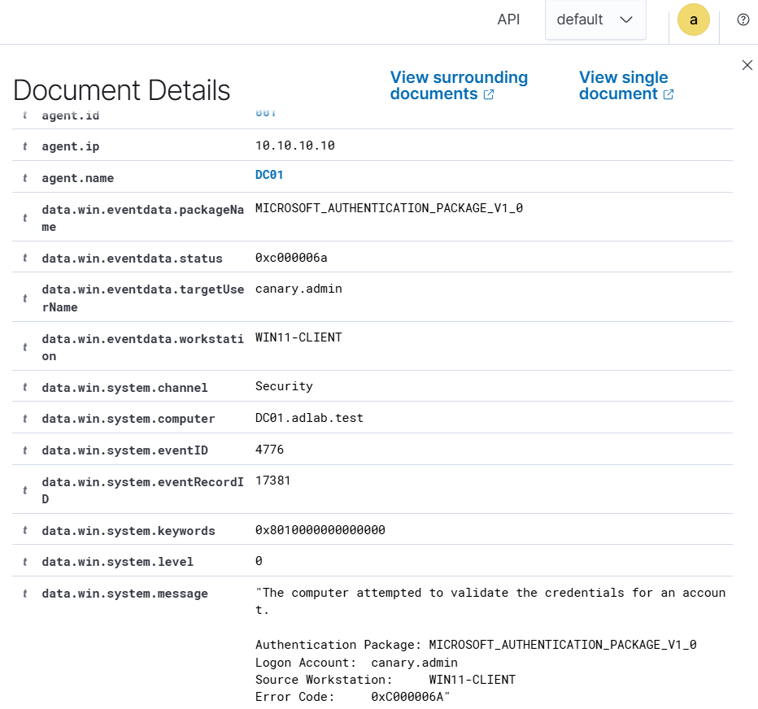

### Custom Wazuh Rule 110150


---

# 18. Targeted Active Directory Object Auditing — Event ID 4662

Directory Service Access auditing was enabled for the domain environment.

A SACL was then applied to the dedicated:

```text
Test-Lab OU
```

A harmless change was made to generate an auditable object operation.

## Important Finding

Enabling Directory Service Access auditing by itself was not enough.

Event `4662` required:

```text
Audit Policy + Object-Level SACL
```

This demonstrated a practical Windows auditing concept that is often missed in basic labs.

## Evidence

### Directory Service Audit Policy

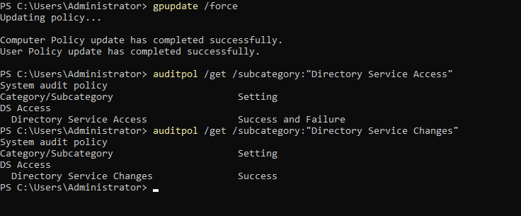

### Advanced AD Auditing

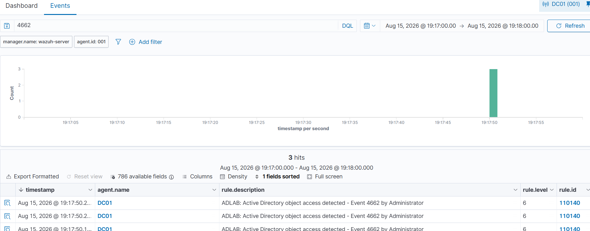

### Local Event 4662

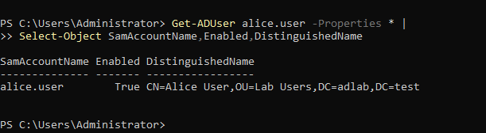

### Wazuh Event 4662

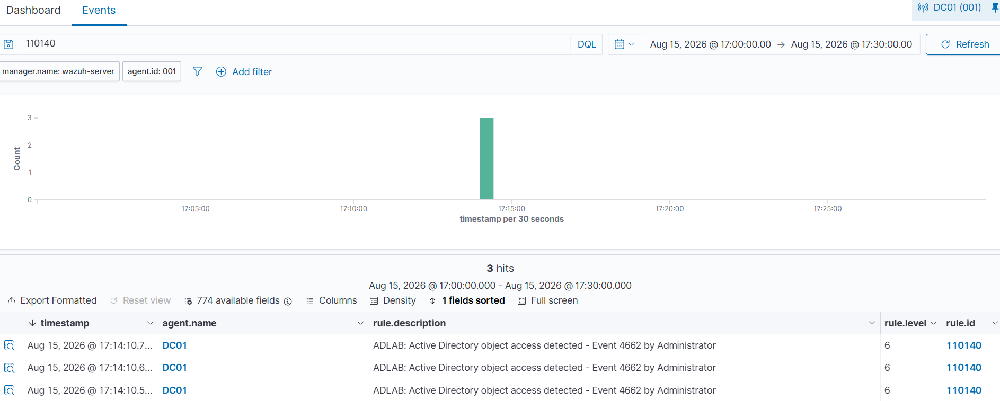

### AD Object Hunting View

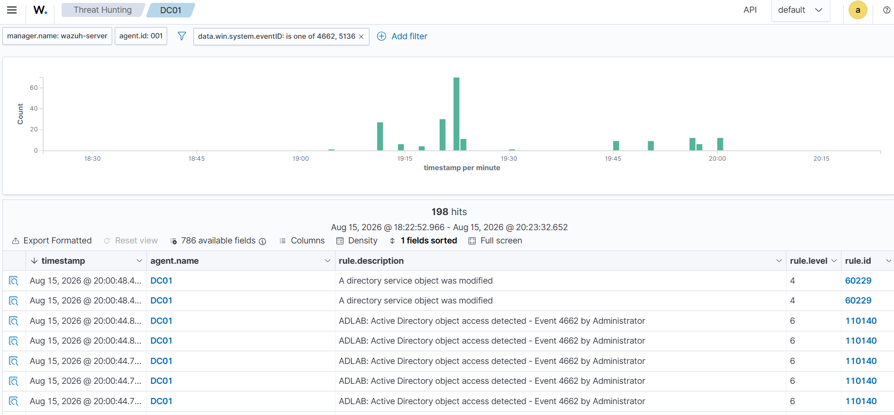

---

# 19. LDAP Diagnostic Visibility — Event ID 1644

LDAP Field Engineering diagnostics were temporarily enabled on DC01.

A controlled Active Directory query generated:

```text
Event ID 1644
```

The event was successfully observed locally in the Directory Service event log.

## Result

**🟡 Local telemetry validated / Wazuh ingestion gap**

The event was not successfully confirmed in Wazuh.

This gap remains documented rather than hidden.

After validation:

```text
15 Field Engineering = 0
```

The temporary LDAP search-time threshold was also removed.

## Evidence

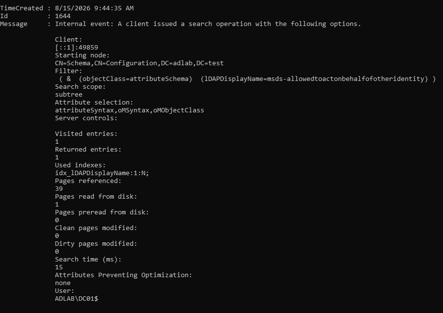

---

# 20. Custom Wazuh Detection Engineering

Custom rules were developed using telemetry actually produced by the lab.

| Rule ID | Detection | Status |
|---:|---|---|
| `110100` | Kerberoasting | ✅ Validated |
| `110110` | Password spraying / repeated authentication failures | ✅ Validated |
| `110120` | PowerShell Active Directory reconnaissance | ✅ Validated |
| `110130` | Network service discovery / Nmap reconnaissance | ✅ Validated |
| `110150` | Canary-account authentication | ✅ Validated |

Operational rules are stored in:

[`detections/wazuh/local_rules.xml`](detections/wazuh/local_rules.xml)

## Wazuh Rule Testing

The manager-side testing utility was verified:

```text
/var/ossec/bin/wazuh-logtest
```

Live EventChannel events were the primary validation method for the custom rules.

### wazuh-logtest Evidence

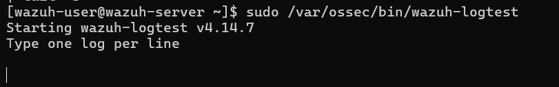

---

# 21. Sigma Detection-as-Code

Three vendor-neutral Sigma detections were created.

## Kerberoasting

[`detections/sigma/kerberoasting.yml`](detections/sigma/kerberoasting.yml)

## PowerShell Active Directory Reconnaissance

[`detections/sigma/powershell-ad-recon.yml`](detections/sigma/powershell-ad-recon.yml)

## Privileged Group Membership Change

[`detections/sigma/privileged-group-change.yml`](detections/sigma/privileged-group-change.yml)

Sigma provides a portable detection specification.

The Wazuh XML rules remain the operational Wazuh implementation.

The project does not claim that simply storing Sigma YAML files causes Wazuh to execute them.

---

# 22. Threat Hunting Workflows

Repeatable Wazuh hunting searches were documented in:

[`dashboards/wazuh-saved-searches.md`](dashboards/wazuh-saved-searches.md)

## Authentication Hunting

Relevant events:

```text
4624
4625
4771
4776
```


## Kerberos Hunting

```text
4769
```


## PowerShell Hunting

```text
4104
```


## Privileged Group Change Hunting

```text
4728
4732
4756
```


## Active Directory Object Hunting

```text
4662
5136
```


## Canary Authentication

```text
rule.id:110150
```

## Network Reconnaissance

```text
rule.id:110130
```

These searches make the project repeatable for an analyst instead of relying only on individual screenshots.

---

# 23. Benign Enterprise-Like Noise

Detection testing in a completely silent lab can produce unrealistic confidence.

To improve validation quality, the project added a benign-noise automation script:

[`automation/benign-noise.ps1`](automation/benign-noise.ps1)

Background activity included:

- DNS resolution
- ICMP reachability checks
- SYSVOL access
- NETLOGON access
- Routine PowerShell activity

The script was used to establish background activity while detections were tested.

## Evidence

### Benign Noise Script

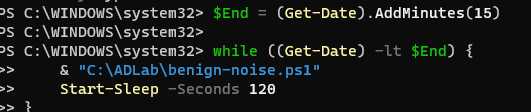

### Automated Benign Noise Run

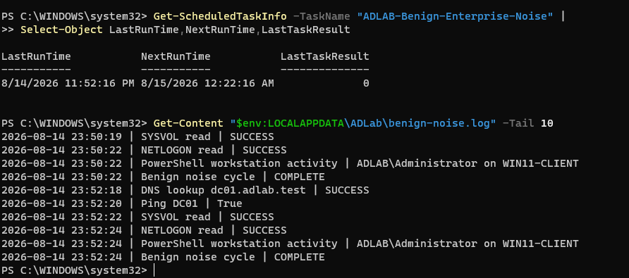

### Scheduled Task

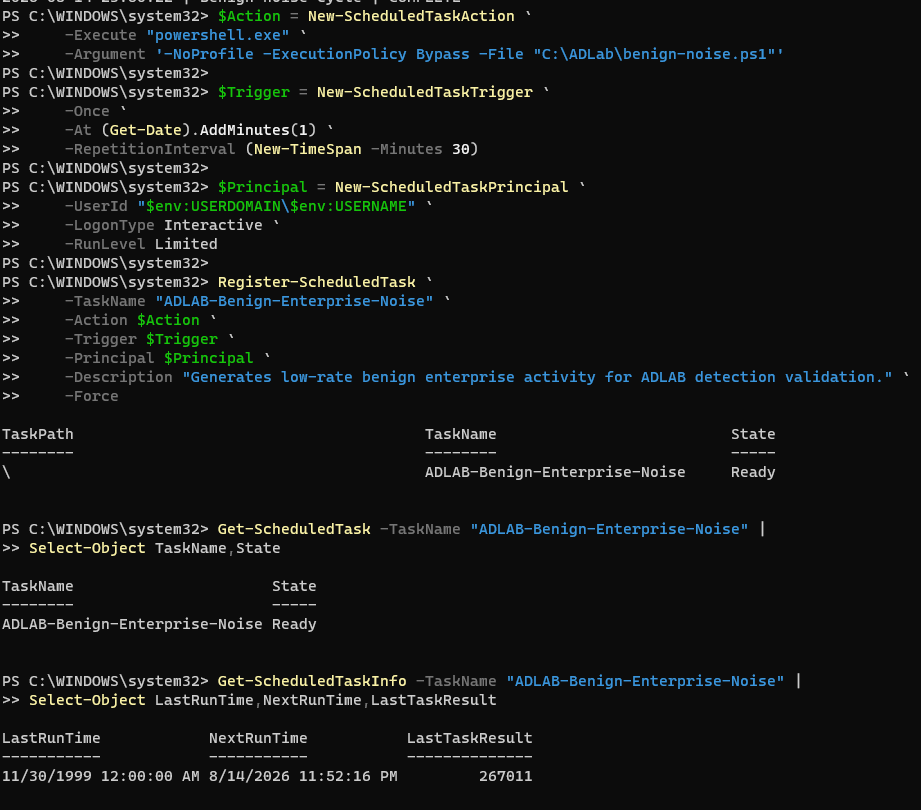

### Baseline Event Distribution

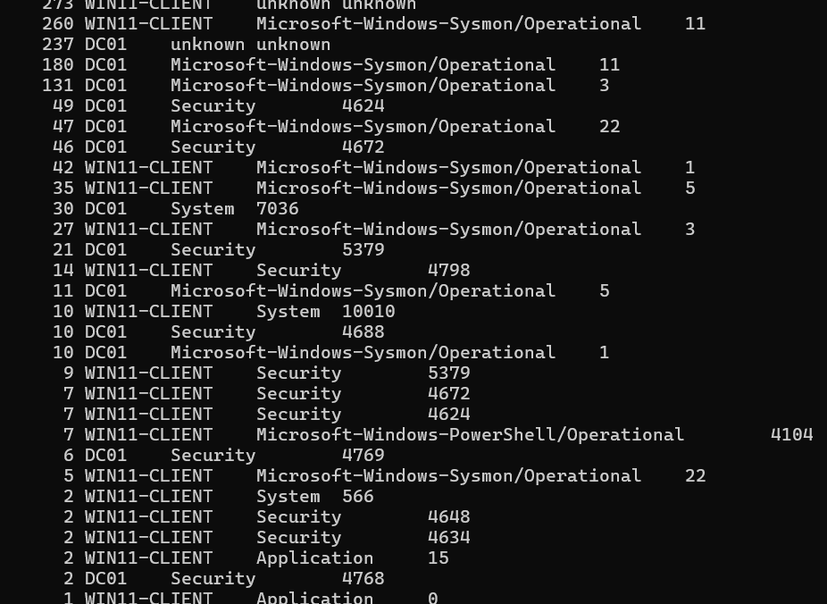

---

# 24. False-Positive Validation

Two detections were explicitly revalidated while benign background traffic was active.

| Detection | Malicious / Controlled Activity | Benign False Positive Observed |
|---|---|---|
| Network reconnaissance / `110130` | ✅ Detected | No observed FP |
| Canary authentication / `110150` | ✅ Detected | No observed FP |

This improved the credibility of the project because the rules were not validated only against a silent environment.

## Canary Validation Under Noise

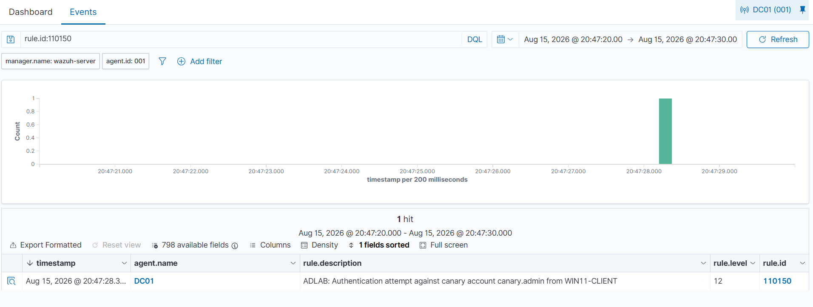

Full noise report:

[`reports/noise-baseline.md`](reports/noise-baseline.md)

---

# 25. Detection Validation Matrix

The project used a structured detection-validation matrix rather than relying only on screenshots.

| ID | Scenario | Expected / Observed Telemetry | Detection Outcome |
|---|---|---|---|
| `ADLAB-001` | Failed-login burst | Authentication failures | ✅ Rule `110110` |
| `ADLAB-002` | Kerberoasting | `4769` | ✅ Rule `110100` |
| `ADLAB-003` | PowerShell AD reconnaissance | `4104` / Sysmon | ✅ Rule `110120` |
| `ADLAB-004` | Privileged-group membership | `4728` | ✅ Wazuh `60159`, Level 12 |
| `ADLAB-005` | Canary authentication | `4776` | ✅ Rule `110150`, Level 12 |
| `ADLAB-006` | Remote administrative logon | `4624`, Type 3 | 🟡 Logged but not alerted |
| `ADLAB-007` | AD object access | `4662` | ✅ Telemetry validated |
| `ADLAB-008` | LDAP diagnostics | `1644` | 🟡 Local only / Wazuh ingestion gap |

Full matrix:

[`reports/detection-validation-matrix.md`](reports/detection-validation-matrix.md)

---

# 26. Hardening

The environment was hardened after detection testing.

The objective was to remove intentionally weakened test conditions without breaking monitoring.

## Service Account — `svc_web`

### Test State

- SPN configured
- Deliberately weak lab-only password used during the scenario
- Standard non-admin identity

### Hardened State

- Password replaced with a strong unique lab-only password
- Account remained non-administrative
- Membership verified as `Domain Users`

## Privileged Membership

`helpdesk.test` was removed from:

```text
Domain Admins
```

Final membership verification confirmed that the temporary privilege had been removed.

## Canary Account

The canary remained:

```text
Enabled: False
Privilege: Non-administrative
```

## LDAP Diagnostics

Temporary diagnostic state:

```text
15 Field Engineering = 5
```

Hardened state:

```text
15 Field Engineering = 0
```

The temporary search threshold was removed.

## Monitoring

Monitoring remained active after hardening:

```text
Sysmon on DC01          Running
Sysmon on WIN11-CLIENT  Running
Wazuh on DC01           Running
Wazuh on WIN11-CLIENT   Running
```

## Hardening Evidence

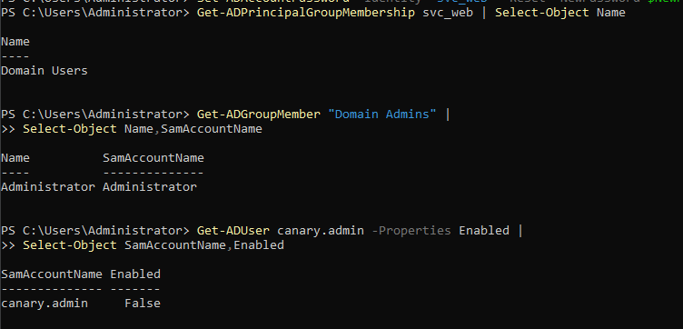

---

# 27. Post-Hardening Detection Retest

Hardening should not silently destroy visibility.

After remediation, the canary detection was triggered again.

Custom rule:

```text
110150
```

successfully fired.

## Result

**✅ Detection pipeline remained operational after hardening**

### Evidence

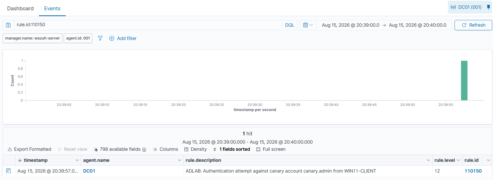

This demonstrates that the weaknesses introduced for controlled testing could be removed while retaining defensive monitoring.

---

# 28. Before vs. After

| Control | Test State | Hardened State |
|---|---|---|
| `svc_web` password | Deliberately weak lab password | Strong unique password |
| `svc_web` privilege | Standard SPN account | Least privilege retained |
| `helpdesk.test` | Temporarily Domain Admin | Removed |
| `canary.admin` | Disabled | Remains disabled |
| LDAP diagnostics | Temporarily verbose | Disabled |
| Windows auditing | Enabled | Retained |
| PowerShell logging | Enabled | Retained |
| Sysmon | Active | Retained |
| Wazuh | Active | Retained |
| Benign-noise automation | Active for validation | Stopped after testing |

---

# 29. Key Detection Engineering Findings

## 29.1 Raw Telemetry Is Not the Same as an Alert

The remote WinRM test produced the expected:

```text
4624 / Logon Type 3
```

but the exact event was not confirmed as a dedicated Wazuh alert.

This demonstrates the difference between:

**log generation → collection → decoding → correlation → alerting**

A detection engineer must validate every stage.

## 29.2 Detection Context Matters

Event `4769` is common in Active Directory environments.

A useful Kerberoasting detection cannot simply classify every 4769 event as malicious.

Context such as:

- Service
- User
- Source
- Encryption
- Frequency
- Expected behavior

is essential.

## 29.3 Canary Identities Provide High-Signal Detection

Because `canary.admin` is disabled and has no legitimate workflow, an authentication attempt against it is unusual by design.

This made rule `110150` one of the highest-confidence detections in the lab.

## 29.4 Active Directory Auditing Requires Object-Level Configuration

Enabling Directory Service Access auditing did not automatically produce useful `4662` events.

A SACL on the monitored object was also required.

## 29.5 Telemetry Gaps Should Be Documented

LDAP Event `1644` was successfully generated locally but was not confirmed in Wazuh.

The project records that as an ingestion gap instead of claiming a detection that did not occur.

## 29.6 False-Positive Validation Matters

Running normal background activity during detection testing made it possible to determine whether the tuned detections remained useful outside a silent laboratory condition.

---

# 30. Complete Evidence Gallery

This section intentionally includes **every screenshot currently stored in the repository**, grouped by project phase.

---

## 30.1 Canary Evidence

### Canary Account Disabled


### Canary Authentication Attempt


### Canary Event 4776


### Canary 4776 in Wazuh


### Canary Event Details


### Custom Canary Rule 110150


---

## 30.2 Day 1 Evidence


---

## 30.3 Day 2 Evidence


---

## 30.4 Day 3 — Audit Policy and Directory Service Evidence


---

## 30.5 Day 3 — PowerShell Evidence


---

## 30.6 Day 3 — Kerberos Evidence


---

## 30.7 Day 3 — Sysmon Evidence


---

## 30.8 Day 3 — Wazuh Platform Evidence


---

## 30.9 Day 3 — Wazuh Detection Evidence


---

## 30.10 Day 3 — Hunting Evidence


---

## 30.11 Day 4 — Benign Baseline Evidence


---

## 30.12 Day 4 — Kali / Reconnaissance Evidence


---

## 30.13 Day 7 — Hardening and Retest Evidence


---

## 30.14 Test 05 — Remote Logon Evidence


---

## 30.15 Test 06 — Privileged Group Change Evidence


---

## 30.16 Wazuh Rule-Testing Tool


---

# 31. Detailed Reports

Each major validation area is also documented separately.

## Scenario Reports

- [`Test 01 — Reconnaissance`](reports/test-01-reconnaissance.md)
- [`Test 02 — Password Spray`](reports/test-02-password-spray.md)
- [`Test 03 — Kerberoasting`](reports/test-03-kerberoasting.md)
- [`Test 04 — PowerShell Reconnaissance`](reports/test-04-powershell.md)
- [`Test 05 — Remote Logon`](reports/test-05-lateral-movement.md)
- [`Test 06 — Privileged Group Change`](reports/test-06-privilege-change.md)

## Validation and Summary Reports

- [`Detection Validation Matrix`](reports/detection-validation-matrix.md)
- [`Noise Baseline`](reports/noise-baseline.md)
- [`Final Summary`](reports/final-summary.md)

---

# 32. Limitations

The project intentionally documents its limitations.

- Local VirtualBox environment
- Single Domain Controller
- Small number of users and endpoints
- Simplified network architecture
- No production EDR
- No SOAR platform
- No production identity-governance system
- No destructive testing
- No credential dumping
- No DCSync
- No Golden or Silver Ticket testing
- LDAP Event 1644 was generated locally but not confirmed in Wazuh
- Remote Type-3 logon was logged locally but no exact Wazuh alert was confirmed
- Sigma files were created as portable detections; they were not represented as automatically executable Wazuh rules
- Alert latency was not presented as precisely measured where it was not explicitly recorded

These limitations improve the credibility of the project because they prevent the results from being overstated.

---

# 33. Future Improvements

Potential future extensions include:

- Add a second Domain Controller
- Add replication-aware detections
- Add Windows Event Forwarding
- Add CI validation for Wazuh XML
- Add CI validation for Sigma YAML
- Add an internal file server
- Implement a Group Managed Service Account
- Compare gMSA telemetry with traditional service accounts
- Add an EDR platform
- Add Microsoft Defender for Identity
- Translate Sigma rules into another SIEM backend
- Improve Directory Service Event 1644 ingestion
- Build a dedicated privileged Type-3 remote-logon detection
- Expand benign-noise profiles
- Add repeatable regression tests for detection changes
- Add automated ATT&CK mapping validation
- Add alert-quality metrics and measured detection latency

---

# 34. Skills Demonstrated

This project demonstrates practical experience with:

- Active Directory administration
- Windows Server 2022
- Windows 11 domain integration
- DNS
- Group Policy
- Windows Advanced Audit Policy
- Windows Security Event Logs
- Kerberos
- LDAP diagnostics
- Sysmon
- PowerShell Script Block Logging
- Wazuh SIEM
- Wazuh EventChannel collection
- Custom Wazuh XML rules
- Detection correlation
- Sigma detection-as-code
- Threat hunting
- MITRE ATT&CK mapping
- Authentication investigation
- Privileged-group monitoring
- Active Directory object auditing
- Canary identities
- False-positive analysis
- Detection tuning
- Benign traffic baselining
- Security hardening
- Post-remediation validation
- Incident-analysis thinking
- Git / GitHub documentation
- Evidence-driven reporting

---

# 35. Portfolio Outcome

The project demonstrates more than the ability to execute attack simulations.

It demonstrates the ability to:

1. Design an isolated Active Directory lab.
2. Deploy Windows domain infrastructure.
3. Configure identity, endpoint, and directory-service telemetry.
4. Generate controlled security activity.
5. Investigate raw Windows events.
6. Forward and analyze endpoint telemetry in a SIEM.
7. Engineer custom detections.
8. Correlate repeated activity.
9. Create portable Sigma detections.
10. Build repeatable threat-hunting workflows.
11. Validate detections using real generated events.
12. Test detections against benign background noise.
13. Identify false positives and telemetry gaps.
14. Apply remediation and hardening.
15. Retest monitoring after hardening.
16. Document both successful detections and failed ingestion paths accurately.

The finished project is therefore an **Active Directory Detection Engineering portfolio lab**, not simply an offensive-security demonstration.

---

# 36. Final Detection Summary

| Scenario | Main Telemetry | SIEM / Detection Result |
|---|---|---|
| Network reconnaissance | Network / Sysmon | ✅ Custom Wazuh `110130` |
| Password spraying | `4625`, `4771`, `4776` | ✅ Custom Wazuh `110110` |
| Kerberoasting | `4769` | ✅ Custom Wazuh `110100` |
| PowerShell AD reconnaissance | `4104`, Sysmon | ✅ Custom Wazuh `110120` |
| Remote administrative logon | `4624`, Type 3 | 🟡 Logged, dedicated alert not confirmed |
| Privileged-group change | `4728` | ✅ Wazuh `60159`, Level 12 |
| Canary authentication | `4776` | ✅ Custom Wazuh `110150`, Level 12 |
| AD object auditing | `4662` | ✅ Telemetry validated |
| LDAP diagnostic telemetry | `1644` | 🟡 Local event validated; Wazuh gap |

---

# 37. Conclusion

The final lab demonstrates the complete detection-engineering lifecycle.

The strongest part of the project is not any single simulated technique. It is the combination of:

- infrastructure,
- telemetry,
- attack-like activity,
- custom detections,
- threat hunting,
- false-positive testing,
- validation,
- hardening,
- retesting,
- and transparent documentation.

The project also intentionally records where the pipeline did **not** behave as expected.

The remote Type-3 logon remained a logged-but-not-alerted scenario, and LDAP Event 1644 remained a local-only telemetry validation.

Those findings are part of the project rather than omissions, because a real detection-engineering workflow must identify both successful detections and monitoring gaps.

The final repository provides reproducible configuration, detection logic, evidence, reports, and validation artifacts that can be reviewed independently.

---

## Disclaimer

This repository is for educational and authorized cybersecurity laboratory use only.

All testing was performed against systems intentionally created and owned for this private lab.
