# Active Directory Attack & Detection Lab

A hands-on **Active Directory Detection Engineering lab** built in VirtualBox using Windows Server 2022, Windows 11, Sysmon, Wazuh SIEM, Sigma, and Kali Linux.

The project is designed around a complete defensive workflow:

**Build → Generate Activity → Collect Telemetry → Detect → Investigate → Tune → Harden → Document**

Rather than focusing only on attack execution, the goal is to understand how identity and endpoint activity appears in Windows logs, engineer repeatable detections, validate alert quality, investigate evidence, and document the results as a cybersecurity portfolio project.

---

## Project Status

**Current Stage: Day 3 — Telemetry & Monitoring Setup**

| Phase                                      | Status     |
| ------------------------------------------ | ---------- |
| Day 1 — Domain Controller                  | ✅ Complete |
| Day 2 — AD Identities & Domain Workstation | ✅ Complete |
| Day 3 — Windows Auditing                   | ✅ Complete |
| Day 3 — PowerShell Logging                 | ✅ Complete |
| Day 3 — Sysmon                             | ✅ Complete |
| Day 3 — Wazuh Deployment                   | ⏳ Next     |
| Day 3 — Benign Noise Automation            | ⏳ Pending  |
| Day 4 — Recon & Authentication Testing     | ⏳ Pending  |
| Day 5 — Kerberos & PowerShell Detection    | ⏳ Pending  |
| Day 6 — Remote Logon & Privilege Changes   | ⏳ Pending  |
| Day 7 — Hardening & Final Validation       | ⏳ Pending  |

---

# Lab Architecture

The environment is hosted locally in **Oracle VirtualBox**.

```text
Windows Host
│
└── VirtualBox
    │
    └── Internal Network: AD-LAB
        │
        ├── DC01
        │   ├── Windows Server 2022
        │   ├── Active Directory Domain Services
        │   ├── DNS
        │   ├── Advanced Windows Auditing
        │   ├── PowerShell Logging
        │   └── Sysmon
        │
        ├── WIN11-CLIENT
        │   ├── Windows 11 Pro
        │   ├── Domain Workstation
        │   └── Sysmon
        │
        ├── WAZUH
        │   └── Planned Wazuh SIEM server
        │
        └── KALI
            └── Planned controlled testing workstation
```

---

# Network Plan

| Host           | Role                      |    IP Address | Status    |
| -------------- | ------------------------- | ------------: | --------- |
| `DC01`         | Domain Controller + DNS   | `10.10.10.10` | ✅ Active  |
| `WIN11-CLIENT` | Domain Workstation        | `10.10.10.20` | ✅ Active  |
| `WAZUH`        | Wazuh Manager / Dashboard | `10.10.10.30` | ⏳ Pending |
| `KALI`         | Controlled Testing Host   | `10.10.10.50` | ⏳ Pending |

### VirtualBox Network

```text
Network Name: AD-LAB
Type: Internal Network
Subnet: 10.10.10.0/24
```

Temporary **NAT adapters** were used during installation where Internet access was required.

The security-testing environment remains based on the isolated `AD-LAB` Internal Network.

---

# Day 1 — Domain Controller Deployment

## Windows Server

A Windows Server 2022 virtual machine was created with:

```text
Hostname: DC01
RAM: 4 GB
vCPU: 2
Virtual Disk: 60 GB
Operating System: Windows Server 2022 Desktop Experience
```

The **Desktop Experience** edition was selected to provide access to Server Manager, Active Directory Users and Computers, DNS Manager, Group Policy Management, and Event Viewer.

---

## Static Network Configuration

The AD-LAB interface on DC01 was configured with:

```text
IP Address: 10.10.10.10
Subnet Mask: 255.255.255.0
Default Gateway: None
DNS Server: 10.10.10.10
```

The hostname and network configuration were validated using:

```powershell
hostname
ipconfig
```

### Evidence

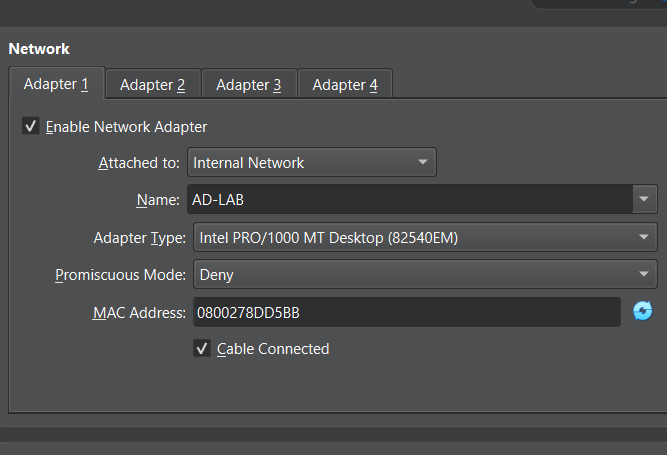

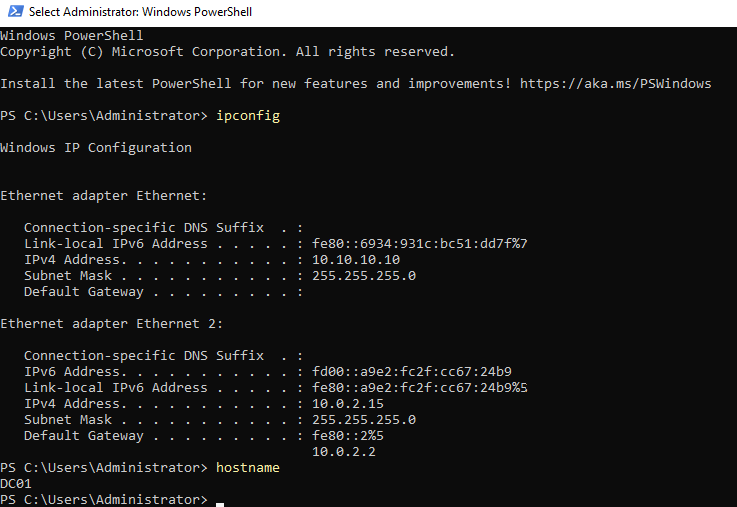

---

# Active Directory Domain Services

The following server roles were installed:

* Active Directory Domain Services
* DNS Server

DC01 was then promoted to a Domain Controller.

A new Active Directory forest was created:

```text
DNS Domain: adlab.test
NetBIOS Domain: ADLAB
Domain Controller: DC01
```

Domain functionality was verified using:

```powershell
whoami
Get-ADDomain
```

The domain Administrator account resolved as:

```text
ADLAB\Administrator
```

### Evidence

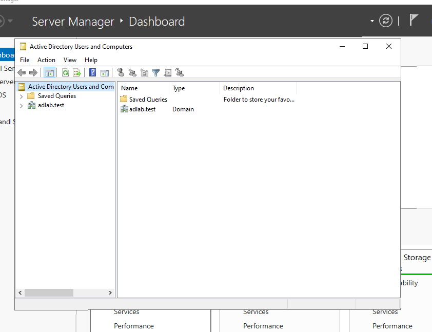

---

# Day 2 — Active Directory Structure

Several Organizational Units were created to keep the lab organized.

```text
adlab.test
│
├── Lab Users
├── Service Accounts
├── Workstations
├── Servers
└── Groups
```

The default Active Directory `Users` container was left unchanged.

A dedicated **Lab Users OU** was created instead because Organizational Units can later be targeted by Group Policy, permissions, and auditing.

### Evidence

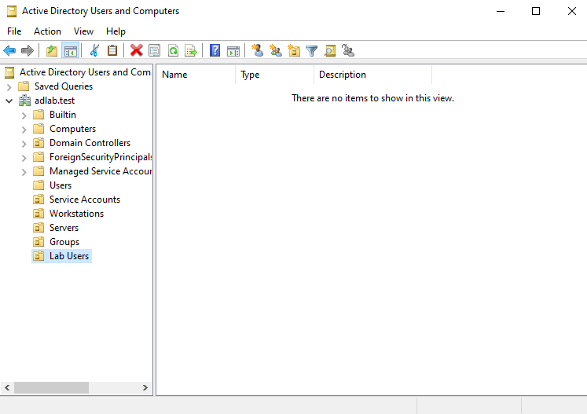

---

# Lab Identities

The following accounts were created:

| Account         | Purpose                      | Enabled    |
| --------------- | ---------------------------- | ---------- |
| `alice.user`    | Normal domain user           | ✅          |
| `bob.user`      | Secondary normal domain user | ✅          |
| `helpdesk.test` | Helpdesk / privilege testing | ✅          |
| `svc_web`       | Kerberos service account     | ✅          |
| `canary.admin`  | Authentication tripwire      | ❌ Disabled |

Passwords used in the environment are **lab-only credentials** and are not stored in this repository.

---

# Automated AD Account Provisioning

Part of the account provisioning process was automated using PowerShell.

The sanitized automation script is stored at:

```text
automation/create-lab-users.ps1
```

The script uses:

```powershell
Read-Host -AsSecureString
```

to request passwords interactively rather than storing credentials inside source code.

The script provisions:

* `bob.user`
* `helpdesk.test`
* `svc_web`
* `canary.admin`

It also registers the test Kerberos SPN.

---

# Kerberos Service Account

A dedicated service account was created:

```text
svc_web
```

A test HTTP Service Principal Name was registered:

```text
HTTP/web.adlab.test
```

Using:

```cmd
setspn -S HTTP/web.adlab.test ADLAB\svc_web
```

The SPN was verified using:

```cmd
setspn -L ADLAB\svc_web
```

This account will later be used during the controlled **Kerberoasting detection scenario**.

### Evidence

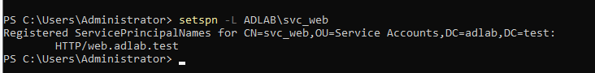

---

# Canary Identity

A dedicated canary identity was created:

```text
canary.admin
```

The account is:

* Disabled
* Non-privileged
* Never used for normal administration
* Reserved exclusively as a detection tripwire

Later in the project, any authentication attempt targeting this account will be treated as high-signal security activity.

---

# Windows 11 Domain Workstation

A Windows 11 Pro VM was created:

```text
Hostname: WIN11-CLIENT
IP Address: 10.10.10.20
Subnet Mask: 255.255.255.0
DNS Server: 10.10.10.10
```

The workstation uses DC01 as its DNS server so Active Directory resources can be resolved correctly.

Connectivity was validated using:

```cmd
ping 10.10.10.10
nslookup dc01.adlab.test
```

---

# DNS Cleanup

During setup, DC01 temporarily had a VirtualBox NAT adapter.

The NAT interface registered additional addresses in Active Directory DNS, including:

```text
10.0.2.15
```

and a temporary IPv6 address.

These records were removed so that:

```text
dc01.adlab.test
```

resolves only to:

```text
10.10.10.10
```

Final validation:

```powershell
Resolve-DnsName dc01.adlab.test
```

Result:

```text
dc01.adlab.test    A    10.10.10.10
```

This ensures domain clients communicate with DC01 through the isolated AD-LAB interface.

---

# Domain Join

`WIN11-CLIENT` was successfully joined to:

```text
adlab.test
```

The domain join was performed using an authorized domain administrator account.

### Evidence

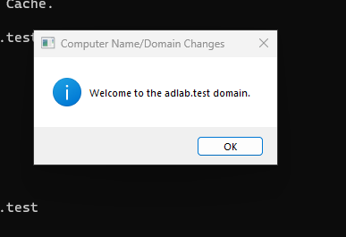

---

# Domain User Authentication

After restarting the workstation, a domain login was successfully performed using:

```text
ADLAB\alice.user
```

The session was validated with:

```cmd
whoami
hostname
echo %LOGONSERVER%
```

Observed output:

```text
adlab\alice.user
WIN11-CLIENT
\\DC01
```

This confirms:

* `alice.user` authenticated using Active Directory.
* The workstation hostname is correct.
* Authentication was handled by DC01.

### Evidence

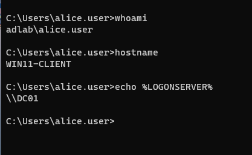

---

# Workstation OU

After the domain join, the `WIN11-CLIENT` computer object was moved from the default Active Directory Computers container into:

```text
OU=Workstations
```

This provides a cleaner structure for future workstation-specific Group Policy and monitoring.

### Evidence

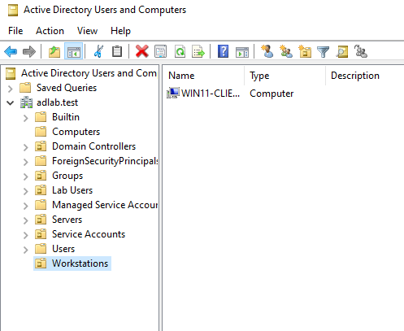

---

# Day 3 — Advanced Windows Auditing

A dedicated Group Policy Object was created:

```text
ADLAB-DC-Auditing
```

The policy is linked to the Domain Controllers OU.

The purpose is to ensure DC01 records the Windows Security telemetry required during later detection scenarios.

---

## Account Logon Auditing

Success and Failure auditing were enabled for:

* Credential Validation
* Kerberos Authentication Service
* Kerberos Service Ticket Operations

Relevant Event IDs include:

```text
4768 — Kerberos TGT requested
4769 — Kerberos service ticket requested
4771 — Kerberos pre-authentication failure
4776 — Credential validation
```

---

## Logon / Logoff Auditing

The following were enabled:

```text
Audit Logon → Success + Failure
Audit Special Logon → Success
```

Relevant Event IDs:

```text
4624 — Successful logon
4625 — Failed logon
4672 — Special privileges assigned
```

---

## Account Management Auditing

Success and Failure auditing were enabled for:

* User Account Management
* Security Group Management

Important events include:

```text
4720 — User account created
4728 — Member added to security-enabled global group
4732 — Member added to security-enabled local group
4756 — Member added to security-enabled universal group
```

These events will later support the privileged-group-change scenario.

---

# Process Creation Auditing

Detailed Tracking / Process Creation auditing was enabled.

Relevant event:

```text
4688 — New process created
```

The following Group Policy setting was also enabled:

```text
Include command line in process creation events
```

This improves investigation quality by recording command-line information associated with process creation.

The policy was applied using:

```powershell
gpupdate /force
```

### Evidence

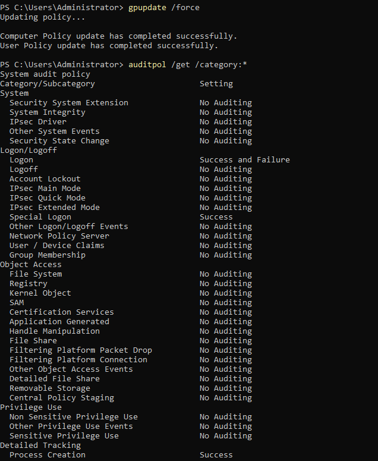

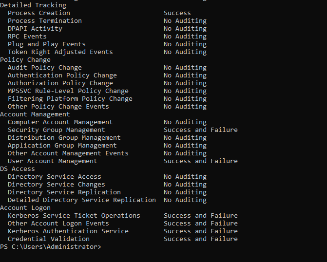

The configuration is documented in:

```text
configs/windows-auditing/advanced-audit-policy.md
```

---

# PowerShell Logging

PowerShell telemetry was enabled through Group Policy.

Enabled settings include:

* PowerShell Script Block Logging
* PowerShell Module Logging
* Command-line logging for process creation

Module logging was configured broadly using:

```text
*
```

---

## PowerShell Logging Validation

A controlled PowerShell command was executed:

```powershell
Write-Host "ADLAB PowerShell logging test"
```

The corresponding telemetry was located in:

```text
Applications and Services Logs
→ Microsoft
→ Windows
→ PowerShell
→ Operational
```

The command was successfully recorded as:

```text
Event ID 4104
```

This confirms PowerShell Script Block Logging is functioning.

### Evidence

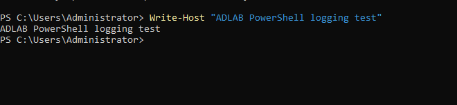

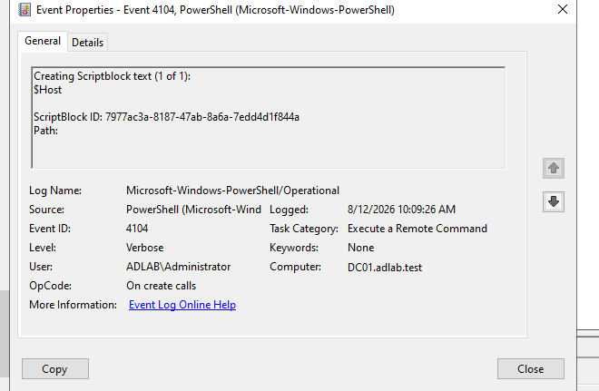

Configuration documentation:

```text
configs/windows-auditing/powershell-logging.md
```

---

# Sysmon Deployment

Microsoft Sysinternals Sysmon was installed on:

```text
WIN11-CLIENT
DC01
```

Sysmon provides enhanced endpoint telemetry that will later be forwarded into Wazuh.

Important Sysmon Event IDs for this project are:

| Event ID | Description        |
| -------: | ------------------ |
|        1 | Process Creation   |
|        3 | Network Connection |
|       11 | File Creation      |
|       22 | DNS Query          |

---

# WIN11-CLIENT Sysmon Validation

Sysmon was installed and the service was confirmed to be running.

### Evidence

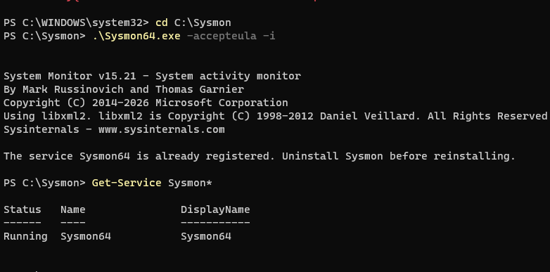

A controlled process was then launched:

```powershell
notepad.exe
```

Sysmon successfully recorded:

```text
Event ID 1 — Process Create
```

### Evidence

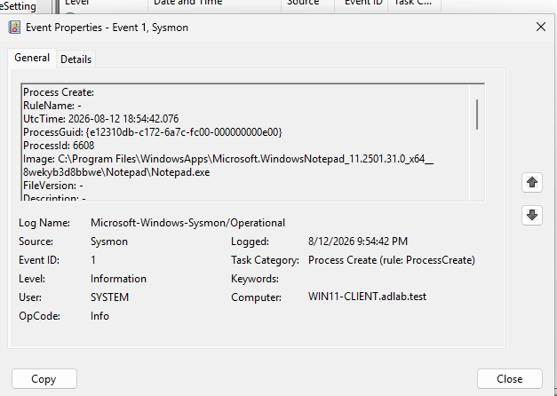

---

# Sysmon Configuration

A minimal lab Sysmon configuration was created:

```text
configs/sysmon/sysmon-config.xml
```

Current configuration:

```xml
<Sysmon schemaversion="4.90">
  <HashAlgorithms>sha256</HashAlgorithms>
  <EventFiltering>
    <ProcessCreate onmatch="exclude" />
    <NetworkConnect onmatch="exclude" />
    <FileCreate onmatch="exclude" />
    <DnsQuery onmatch="exclude" />
  </EventFiltering>
</Sysmon>
```

The configuration enables broad collection of the event categories required during this lab.

It is intentionally simple because this is a controlled environment. A real enterprise Sysmon deployment would require significantly more filtering and tuning.

---

# Applying the Sysmon Configuration

The configuration was applied using:

```powershell
.\Sysmon64.exe -c .\sysmon-config.xml
```

The active configuration can be inspected using:

```powershell
.\Sysmon64.exe -c
```

The same version-controlled configuration is being used across monitored Windows systems.

---

# Sysmon DNS Validation

On WIN11-CLIENT, DNS activity was generated using:

```powershell
Resolve-DnsName dc01.adlab.test
```

The request resolved to:

```text
10.10.10.10
```

Sysmon DNS telemetry is used to provide process-to-domain visibility through:

```text
Event ID 22 — DNS Query
```

### Evidence

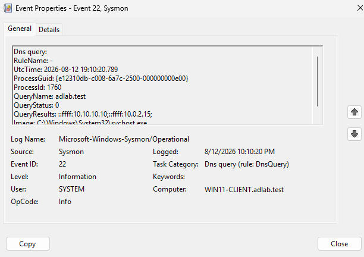

---

# DC01 Sysmon Validation

Sysmon was also installed on the Domain Controller.

Initial installation was validated using a controlled process launch:

```powershell
notepad.exe
```

The corresponding:

```text
Event ID 1
```

was observed in the Sysmon Operational log.

### Evidence

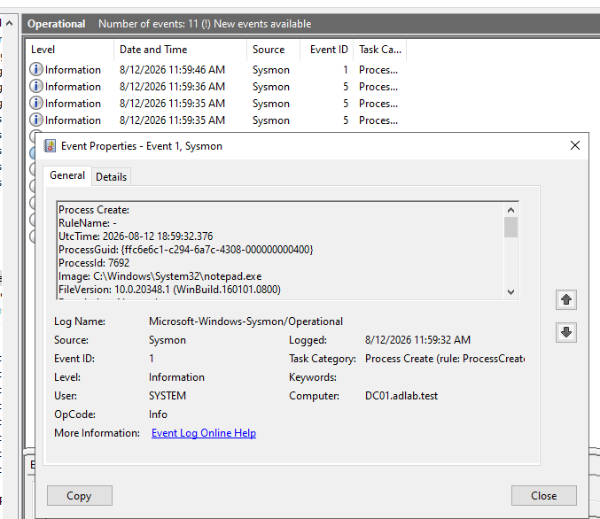

After applying the custom XML configuration, telemetry was validated again.

### Evidence

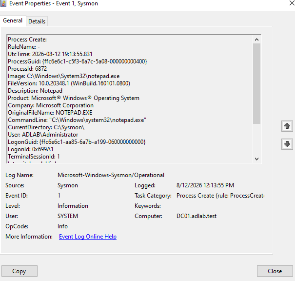

This provides separate evidence for:

1. Initial Sysmon installation.
2. Successful operation after applying the version-controlled configuration.

---

# Current Telemetry Coverage

At the current stage, the lab provides visibility into:

### Windows Security

```text
4624 — Successful logon
4625 — Failed logon
4672 — Special privileges assigned
4688 — Process creation
4728 — Global security group membership change
4732 — Local security group membership change
4756 — Universal security group membership change
4768 — Kerberos TGT request
4769 — Kerberos service ticket request
4771 — Kerberos pre-authentication failure
4776 — Credential validation
```

### PowerShell

```text
4104 — Script Block Logging
```

### Sysmon

```text
1  — Process Creation
3  — Network Connection
11 — File Creation
22 — DNS Query
```

---

# Current Repository Structure

```text
active-directory-attack-detection-lab/
│
├── README.md
│
├── automation/
│   └── create-lab-users.ps1
│
├── configs/
│   ├── sysmon/
│   │   └── sysmon-config.xml
│   │
│   ├── windows-auditing/
│   │   ├── advanced-audit-policy.md
│   │   └── powershell-logging.md
│   │
│   └── wazuh/
│
├── detections/
│   ├── wazuh/
│   └── sigma/
│
├── dashboards/
├── diagrams/
├── screenshots/
├── reports/
└── docs/
```

Additional configuration, detection, dashboard, and reporting files will be added as the project progresses.

---

# Security and Authorization

All activity is performed exclusively inside the isolated:

```text
AD-LAB
```

VirtualBox network using systems and accounts deliberately created for this project.

The lab does **not** target external systems, companies, university infrastructure, home devices, public services, or any environment without explicit authorization.

No real credentials are used.

The repository does not intentionally contain:

* Real passwords
* DSRM passwords
* Domain Administrator passwords
* Tokens
* API keys
* Private keys
* Wazuh enrollment secrets
* VM disk images
* Windows ISO files
* Personal documents

---

# Troubleshooting & Lessons Learned

Several realistic infrastructure issues were encountered during deployment.

## Windows Server Edition

The first Windows Server installation used Server Core.

The VM was reinstalled using:

```text
Windows Server 2022 Standard Evaluation
(Desktop Experience)
```

This provided the GUI needed for easier AD, DNS, Group Policy, and Event Viewer administration.

---

## Windows 11 Networking

Windows 11 initially presented network/OOBE issues during installation.

VirtualBox NAT networking was used temporarily during setup, while the permanent lab interface remained:

```text
Internal Network: AD-LAB
```

---

## Active Directory DNS Registration

DC01 temporarily registered NAT addresses in Active Directory DNS.

This caused:

```text
dc01.adlab.test
```

to return multiple addresses.

The incorrect NAT records were removed and the final DNS result was validated as:

```text
dc01.adlab.test → 10.10.10.10
```

This reinforced the importance of controlling which interfaces a Domain Controller registers in DNS.

---

## Standard vs Administrative Accounts

`alice.user` was intentionally configured as a standard domain user.

Administrative configuration was therefore performed through privileged lab accounts when required.

The actual detection scenarios will use normal user identities wherever appropriate instead of running all activity as Domain Administrator.

---

## Sysmon Configuration Issue

During initial configuration, Windows saved:

```text
sysmon-config.xml
```

as:

```text
sysmon-config.xml.txt
```

The file was also initially empty.

The issue was identified using:

```powershell
dir C:\Sysmon
```

The file was renamed, populated with the correct XML configuration, and successfully applied using:

```powershell
.\Sysmon64.exe -c .\sysmon-config.xml
```

This was then validated through live Sysmon telemetry.

---

# Next Phase — Wazuh SIEM

The next stage of the project is to deploy:

```text
WAZUH
10.10.10.30
```

The planned deployment includes:

* Ubuntu Server 24.04 LTS
* Wazuh Manager
* Wazuh Indexer
* Wazuh Dashboard
* Windows Wazuh agents on DC01 and WIN11-CLIENT

The following telemetry will then be forwarded to Wazuh:

* Windows Security logs
* PowerShell Operational logs
* Sysmon Operational logs
* Active Directory authentication telemetry

---

# Planned Detection Engineering

After Wazuh ingestion is operational, custom detections will be developed.

Planned detection IDs:

| ID          | Detection                                   |
| ----------- | ------------------------------------------- |
| `ADLAB-001` | Failed-logon / password-spray burst         |
| `ADLAB-002` | Suspicious Kerberos service-ticket activity |
| `ADLAB-003` | PowerShell Active Directory reconnaissance  |
| `ADLAB-004` | Privileged group membership change          |
| `ADLAB-005` | Canary account authentication attempt       |

Operational detections will be implemented using:

```text
detections/wazuh/local_rules.xml
```

Portable vendor-neutral detection logic will also be developed using Sigma.

---

# Planned Sigma Rules

```text
detections/sigma/
├── kerberoasting.yml
├── powershell-ad-recon.yml
├── failed-logon-burst.yml
├── privileged-group-change.yml
└── canary-account.yml
```

Rules will only be marked as validated after testing against actual telemetry generated inside the lab.

---

# Planned Detection Scenarios

The project will eventually validate six core scenarios:

1. Active Directory / network reconnaissance
2. Controlled password spraying / failed authentication
3. Kerberoasting against the lab `svc_web` account
4. Suspicious PowerShell Active Directory reconnaissance
5. Controlled remote logon / lateral-movement-like activity
6. Privileged group membership modification

An additional canary-account authentication test will be used as a high-signal identity detection.

---

# Planned Benign Noise Automation

A low-rate PowerShell automation task will later generate normal enterprise-like activity such as:

* DNS queries
* ICMP connectivity checks
* SYSVOL reads
* NETLOGON reads
* Optional internal HTTP requests

This will allow detections to be tested while legitimate background activity is present.

The goal is to measure:

* False positives
* Alert quality
* Detection thresholds
* Context-based tuning

Planned files:

```text
automation/benign-noise.ps1
automation/scheduled-task-setup.ps1
```

---

# Detection Validation Philosophy

Finding a Windows event is not enough.

Each scenario will eventually be validated using:

```text
Controlled Action
        ↓
Raw Windows / Sysmon Telemetry
        ↓
Wazuh Ingestion
        ↓
Detection Rule
        ↓
Alert
        ↓
Analyst Investigation
        ↓
False-Positive Analysis
        ↓
Tuning
        ↓
Mitigation
```

For each detection, the project will record:

* Expected telemetry
* Observed telemetry
* Detection rule
* Alert result
* Approximate alert latency
* False-positive considerations
* Tuning decisions
* Evidence
* Final detection status

Possible statuses include:

```text
Detected
Partially Detected
Logged but Not Alerted
Not Observed
```

A missing automatic alert will be treated as a **detection-engineering gap**, not hidden as a project failure.

---

# MITRE ATT&CK

Later tests will be mapped to relevant MITRE ATT&CK techniques covering areas such as:

* Discovery
* Credential Access
* Execution
* Lateral Movement
* Privilege Escalation
* Persistence
* Account Manipulation

Mappings will only be applied where they accurately describe the controlled lab behavior.

---

# Final Goal

The completed project will demonstrate practical experience with:

* Active Directory administration
* Windows authentication
* Kerberos
* DNS
* Group Policy
* Windows Security Event Logs
* PowerShell telemetry
* Sysmon
* Wazuh SIEM
* Sigma
* Detection engineering
* Threat hunting
* MITRE ATT&CK
* Alert validation
* False-positive tuning
* Identity hardening
* Security documentation
* Git-based detection-as-code

---

## Current Milestone

The core Active Directory environment is operational and endpoint telemetry is now being collected locally.

```text
DC01          ✅ Active Directory + DNS + Auditing + PowerShell + Sysmon
WIN11-CLIENT  ✅ Domain Joined + Domain Authentication + Sysmon
WAZUH         ⏳ Next
KALI          ⏳ Pending
```

**Next milestone: Deploy Wazuh and begin centralized SIEM ingestion.**


### Wazuh SIEM Integration

The lab uses the official Wazuh virtual appliance as the central SIEM platform.

Wazuh was connected to the isolated AD-LAB network using:

- Wazuh Server: `10.10.10.30`
- DC01: `10.10.10.10`
- WIN11-CLIENT: `10.10.10.20`
- Domain: `adlab.test`

Both Windows systems were enrolled as Wazuh agents and verified as Active.

Centralized Windows telemetry collection was configured through Wazuh `agent.conf` for:

- Windows Security Event Log
- Microsoft-Windows-PowerShell/Operational
- Microsoft-Windows-Sysmon/Operational

The configuration was validated with `verify-agent-conf`, and both agents were confirmed synchronized with the Wazuh manager.

### Failed Authentication Validation

A controlled failed NTLM authentication was generated from WIN11-CLIENT against DC01.

Windows auditing generated:

- Event ID 4625 — Failed logon
- Event ID 4776 — Credential validation failure

The failed authentication originated from:

- Source host: `WIN11-CLIENT`
- Source IP: `10.10.10.20`
- Target system: `DC01`

Wazuh successfully ingested the events and generated alerts including:

- Rule 60122 — Logon Failure - Unknown user or bad password
- Rule 60104 — Windows audit failure event

This validated the complete telemetry pipeline:

WIN11-CLIENT → DC01 Security Log → Wazuh Agent → Wazuh Manager → Detection Alert

### Custom Detection Engineering

A custom Wazuh rule was added for potential Kerberoasting activity.

The rule monitors Windows Security Event ID 4769 and identifies Kerberos service ticket requests using RC4 encryption (`0x17`) from non-machine accounts.

MITRE ATT&CK mapping:

- T1558.003 — Steal or Forge Kerberos Tickets: Kerberoasting

The rule is maintained in:

`detections/wazuh/local_rules.xml`