# Active Directory Attack & Detection Lab

A hands-on **Active Directory Detection Engineering lab** built in Oracle VirtualBox using Windows Server 2022, Windows 11, Sysmon, Wazuh SIEM, PowerShell, Group Policy, and controlled attack simulation.

The project follows a defensive workflow:

**Build → Generate Activity → Collect Telemetry → Detect → Investigate → Tune → Harden → Document**

The goal is not simply to execute attacks. The lab is designed to show how identity, Kerberos, authentication, PowerShell, and endpoint activity appear in Windows logs; how those events are ingested into a SIEM; how detections are engineered and validated; and how the final results are documented as detection-as-code.

---

## Project Status

**Current Stage: Day 3 complete — telemetry, Wazuh ingestion, and initial detection engineering validated**

| Phase | Status |
|---|---|
| Day 1 — Domain Controller | ✅ Complete |
| Day 2 — AD Identities & Domain Workstation | ✅ Complete |
| Day 3 — Windows Auditing | ✅ Complete |
| Day 3 — PowerShell Logging | ✅ Complete |
| Day 3 — Sysmon | ✅ Complete |
| Day 3 — Wazuh Deployment | ✅ Complete |
| Day 3 — Wazuh Agent Enrollment | ✅ Complete |
| Day 3 — Kerberoasting Detection | ✅ Complete |
| Day 3 — Password Spray Detection | ✅ Complete |
| Day 3 — Encoded PowerShell Validation | ✅ Complete |
| Day 3 — Suspicious PowerShell 4104 Detection | ✅ Complete |
| Day 3 — Wazuh Cleanup / Config Synchronization | ✅ Complete |
| Benign Noise Automation | ⏳ Pending |
| Recon & Authentication Testing | ⏳ Pending |
| Remote Logon / Lateral-Movement-Like Testing | ⏳ Pending |
| Privileged Group Change Detection | ⏳ Pending |
| Canary Account Detection | ⏳ Pending |
| Sigma Rule Conversion | ⏳ Pending |
| Hardening & Final Validation | ⏳ Pending |

---

# Lab Architecture

The environment is hosted locally in **Oracle VirtualBox**.

```text
Windows Host
│
└── VirtualBox
    │
    ├── Internal Network: AD-LAB (10.10.10.0/24)
    │   │
    │   ├── DC01
    │   │   ├── Windows Server 2022
    │   │   ├── Active Directory Domain Services
    │   │   ├── DNS
    │   │   ├── Group Policy
    │   │   ├── Advanced Windows Auditing
    │   │   ├── PowerShell Logging
    │   │   ├── Sysmon
    │   │   └── Wazuh Agent
    │   │
    │   ├── WIN11-CLIENT
    │   │   ├── Windows 11 Pro
    │   │   ├── Domain Workstation
    │   │   ├── Workstation Logging GPO
    │   │   ├── Sysmon
    │   │   └── Wazuh Agent
    │   │
    │   ├── WAZUH
    │   │   ├── Official Wazuh Virtual Appliance
    │   │   ├── Wazuh Manager
    │   │   ├── Wazuh Indexer
    │   │   └── Wazuh Dashboard
    │   │
    │   └── KALI
    │       └── Planned controlled testing workstation
    │
    ├── Host-Only Network
    │   └── Wazuh management / SSH / dashboard access
    │
    └── Bridged Adapter
        └── Wazuh Internet access only
```

The attack and identity-testing environment remains isolated on `AD-LAB`.

The Wazuh server uses additional management connectivity so the dashboard and SSH can be accessed from the host and so the appliance can reach the Internet without exposing the AD test systems.

---

# Network Plan

| Host | Role | IP Address | Status |
|---|---|---:|---|
| `DC01` | Domain Controller + DNS | `10.10.10.10` | ✅ Active |
| `WIN11-CLIENT` | Domain Workstation | `10.10.10.20` | ✅ Active |
| `WAZUH` | Wazuh Manager / SIEM | `10.10.10.30` | ✅ Active |
| `KALI` | Controlled Testing Host | `10.10.10.50` | ⏳ Pending |

### VirtualBox Internal Network

```text
Network Name: AD-LAB
Type: Internal Network
Subnet: 10.10.10.0/24
```

No default gateway is configured on the AD-LAB interfaces of DC01 or WIN11-CLIENT.

---

# Day 1 — Domain Controller Deployment

## Windows Server

A Windows Server 2022 virtual machine was created with:

```text
Hostname: DC01
RAM: 4 GB
vCPU: 2
Operating System: Windows Server 2022 Desktop Experience
```

The **Desktop Experience** edition was selected so Server Manager, Active Directory Users and Computers, DNS Manager, Group Policy Management, and Event Viewer could be used directly during the lab.

---

## Static Network Configuration

The AD-LAB interface on DC01 was configured with:

```text
IP Address: 10.10.10.10
Subnet Mask: 255.255.255.0
Default Gateway: None
DNS Server: 10.10.10.10
```

Validation:

```powershell
hostname
ipconfig
```

### Evidence


---

# Active Directory Domain Services

The following roles were installed:

- Active Directory Domain Services
- DNS Server

DC01 was promoted to a Domain Controller and a new forest was created:

```text
DNS Domain: adlab.test
NetBIOS Domain: ADLAB
Domain Controller: DC01
```

Validation:

```powershell
whoami
Get-ADDomain
```

Expected domain context:

```text
ADLAB\Administrator
adlab.test
```

### Evidence


---

# Day 2 — Active Directory Structure

The lab uses dedicated Organizational Units:

```text
adlab.test
│
├── Lab Users
├── Service Accounts
├── Workstations
├── Servers
└── Groups
```

The default `Users` container was left unchanged.

Using dedicated OUs makes it possible to apply workstation-specific and Domain Controller-specific Group Policy cleanly.

### Evidence


---

# Lab Identities

| Account | Purpose | Enabled |
|---|---|---|
| `alice.user` | Normal domain user | ✅ |
| `bob.user` | Secondary domain user | ✅ |
| `helpdesk.test` | Helpdesk / privilege testing | ✅ |
| `svc_web` | Kerberos service account | ✅ |
| `canary.admin` | High-signal authentication tripwire | ❌ Disabled |

Passwords are **lab-only** and are not stored in this repository.

---

# Automated AD Account Provisioning

A sanitized provisioning script is stored at:

```text
automation/create-lab-users.ps1
```

Passwords are requested interactively with:

```powershell
Read-Host -AsSecureString
```

The automation provisions lab identities and configures the Kerberos service account without hardcoding passwords into source control.

---

# Kerberos Service Account

Service account:

```text
svc_web
```

Registered SPN:

```text
HTTP/web.adlab.test
```

Configuration:

```cmd
setspn -S HTTP/web.adlab.test ADLAB\svc_web
```

Validation:

```cmd
setspn -L ADLAB\svc_web
```

### Evidence


---

# Canary Identity

The account:

```text
canary.admin
```

is deliberately:

- Disabled
- Non-privileged
- Not used for routine administration
- Reserved for future high-signal detection testing

Any authentication attempt involving this identity will later be treated as suspicious by design.

---

# Windows 11 Domain Workstation

```text
Hostname: WIN11-CLIENT
IP Address: 10.10.10.20
Subnet Mask: 255.255.255.0
DNS Server: 10.10.10.10
```

Connectivity validation:

```cmd
ping 10.10.10.10
nslookup dc01.adlab.test
```

---

# DNS Cleanup

During the initial build, DC01 temporarily used an additional VirtualBox network adapter and registered unwanted addresses in DNS.

The unwanted records included:

```text
10.0.2.15
```

and a temporary IPv6 address.

The incorrect records were removed so:

```text
dc01.adlab.test
```

resolves only to:

```text
10.10.10.10
```

Validation:

```powershell
Resolve-DnsName dc01.adlab.test
```

---

# Domain Join

`WIN11-CLIENT` was successfully joined to:

```text
adlab.test
```

### Evidence


---

# Domain User Authentication

A domain login was validated using:

```text
ADLAB\alice.user
```

Commands:

```cmd
whoami
hostname
echo %LOGONSERVER%
```

Observed:

```text
adlab\alice.user
WIN11-CLIENT
\\DC01
```

### Evidence


---

# Workstation OU

The WIN11 computer object was moved into:

```text
OU=Workstations
```

This later allowed a dedicated workstation logging GPO to be applied.

### Evidence


---

# Day 3 — Advanced Windows Auditing

A dedicated Group Policy Object was created:

```text
ADLAB-DC-Auditing
```

It is linked to the Domain Controllers OU.

## Account Logon Auditing

Success and Failure auditing were enabled for:

- Credential Validation
- Kerberos Authentication Service
- Kerberos Service Ticket Operations

Relevant Event IDs:

```text
4768 — Kerberos TGT requested
4769 — Kerberos service ticket requested
4771 — Kerberos pre-authentication failure
4776 — Credential validation
```

## Logon / Logoff Auditing

```text
Audit Logon → Success + Failure
Audit Special Logon → Success
```

Relevant events:

```text
4624 — Successful logon
4625 — Failed logon
4672 — Special privileges assigned
```

## Account Management Auditing

Success and Failure auditing were enabled for:

- User Account Management
- Security Group Management

Relevant events:

```text
4720 — User account created
4728 — Member added to security-enabled global group
4732 — Member added to security-enabled local group
4756 — Member added to security-enabled universal group
```

## Process Creation Auditing

Process Creation auditing was enabled with command-line inclusion.

Relevant event:

```text
4688 — New process created
```

Policy refresh:

```powershell
gpupdate /force
```

### Evidence


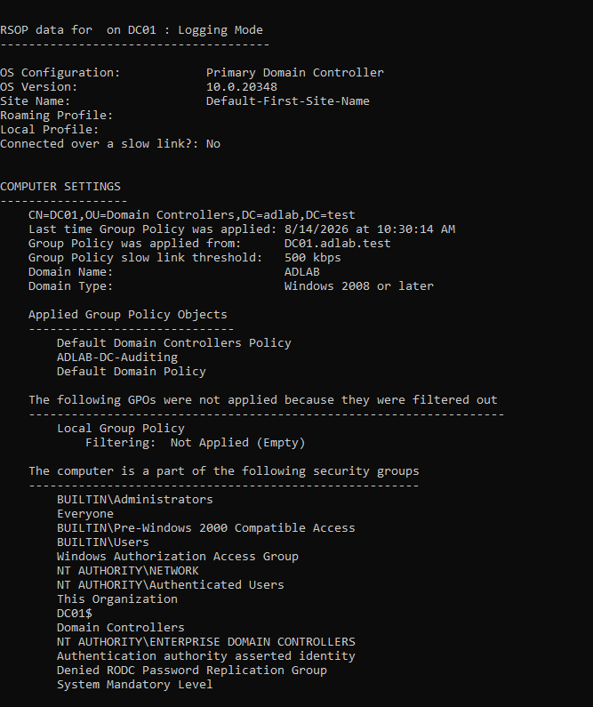

Configuration documentation:

```text
configs/windows-auditing/advanced-audit-policy.md
```

---

# PowerShell Logging

PowerShell logging was initially enabled for DC01 through the DC auditing GPO.

Enabled settings include:

- Script Block Logging
- Module Logging
- Process command-line visibility

Module logging was configured using:

```text
*
```

Initial DC01 validation produced:

```text
Event ID 4104 — PowerShell Script Block Logging
```

### Evidence


Documentation:

```text
configs/windows-auditing/powershell-logging.md
```

---

# Workstation PowerShell Logging

During Wazuh validation, WIN11-CLIENT initially produced no Event ID 4104 records.

Investigation showed that the original:

```text
ADLAB-DC-Auditing
```

GPO was linked only to the Domain Controllers OU.

A second GPO was therefore created:

```text
ADLAB-Workstation-Logging
```

and linked to:

```text
OU=Workstations
```

The following setting was enabled:

```text
Computer Configuration
→ Policies
→ Administrative Templates
→ Windows Components
→ Windows PowerShell
→ Turn on PowerShell Script Block Logging
```

The effective setting was verified on WIN11 through:

```powershell
Get-ItemProperty "HKLM:\SOFTWARE\Policies\Microsoft\Windows\PowerShell\ScriptBlockLogging"
```

Result:

```text
EnableScriptBlockLogging : 1
```

`gpresult` confirmed the workstation GPO was applied.

### Evidence

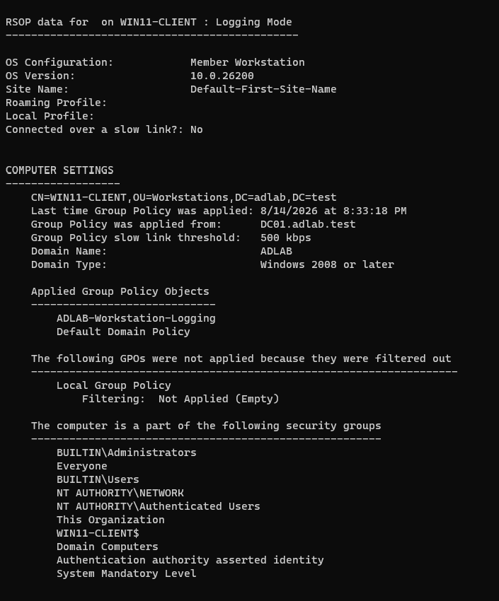

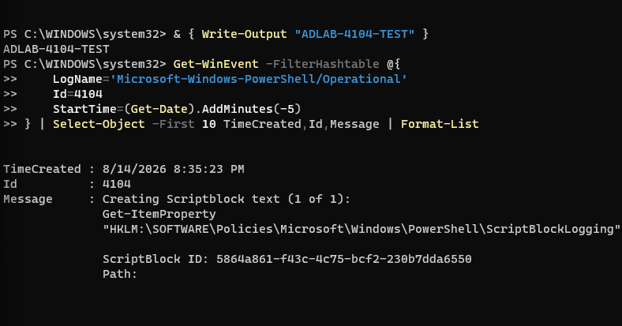

---

# Sysmon Deployment

Microsoft Sysinternals Sysmon was installed on:

```text
DC01
WIN11-CLIENT
```

Important Sysmon Event IDs used by this project:

| Event ID | Description |
|---:|---|
| 1 | Process Creation |
| 3 | Network Connection |
| 11 | File Creation |
| 22 | DNS Query |

---

# Sysmon Configuration

Version-controlled configuration:

```text
configs/sysmon/sysmon-config.xml
```

Current minimal lab configuration:

```xml
<Sysmon schemaversion="4.90">
  <HashAlgorithms>sha256</HashAlgorithms>
  <EventFiltering>
    <ProcessCreate onmatch="exclude" />
    <NetworkConnect onmatch="exclude" />
    <FileCreate onmatch="exclude" />
    <DnsQuery onmatch="exclude" />
  </EventFiltering>
</Sysmon>
```

This configuration deliberately collects broadly because the environment is small and controlled.

A production implementation would require significantly more exclusion logic and tuning.

---

# WIN11 Sysmon Validation

Service operation was confirmed.

### Evidence


A controlled process generated:

```text
Event ID 1 — Process Create
```

### Evidence


DNS activity generated with:

```powershell
Resolve-DnsName dc01.adlab.test
```

produced:

```text
Event ID 22 — DNS Query
```

### Evidence


---

# DC01 Sysmon Validation

Sysmon was also deployed to DC01 and validated with controlled process creation.

### Evidence


---

# Wazuh SIEM Deployment

The initial plan was to install Wazuh manually on Ubuntu Server.

During the manual build, the manager, indexer, and Filebeat portions progressed, but repeated package / I/O problems occurred while installing the Wazuh Dashboard package.

Rather than keep an unstable SIEM build, the manual installation was abandoned and replaced with the **official Wazuh virtual appliance**.

The final implementation uses:

```text
Official Wazuh OVA
Wazuh 4.14.7
AD-LAB IP: 10.10.10.30
```

The appliance runs Wazuh Manager, Indexer, and Dashboard as the central SIEM platform.

The failed manual-install screenshots are intentionally not used as final architecture evidence.

---

# Wazuh Network Configuration

The final Wazuh appliance uses three network roles:

```text
AD-LAB / Internal Network
    → 10.10.10.30
    → Agent communication with DC01 and WIN11

Host-Only
    → Host management access
    → SSH
    → Wazuh Dashboard

Bridged
    → Internet access for the Wazuh appliance
```

The AD-LAB interface was configured with:

```text
IP: 10.10.10.30/24
DNS: 10.10.10.10
DNS search route: adlab.test
```

A resolver issue was also corrected so Wazuh could resolve:

```text
dc01.adlab.test → 10.10.10.10
```

Connectivity between the SIEM and DC01 was validated before deploying agents.

---

# Wazuh Agent Deployment

Wazuh Windows agents were installed on both monitored Windows systems.

## DC01

```text
Agent ID: 001
Name: DC01
IP: 10.10.10.10
Status: Active
```

### Evidence

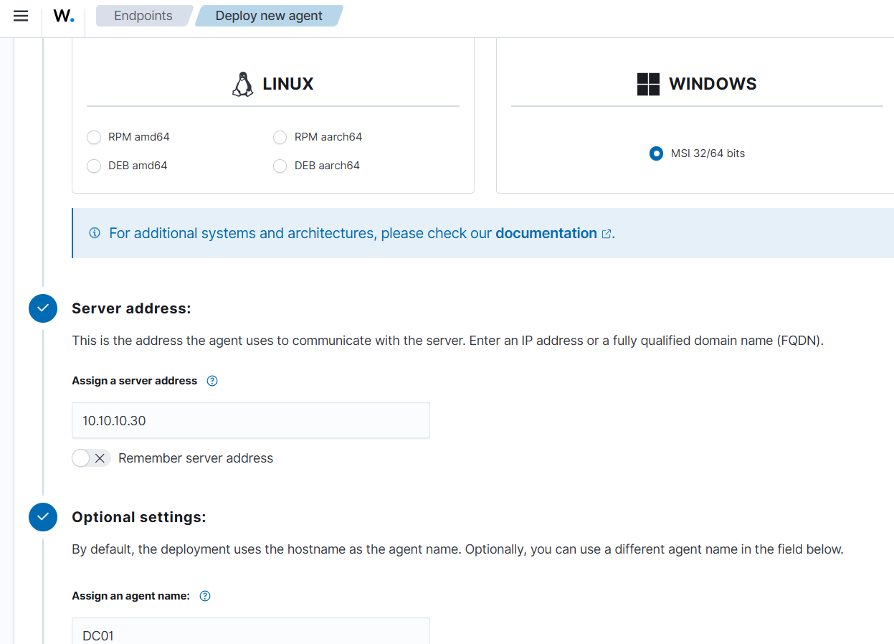

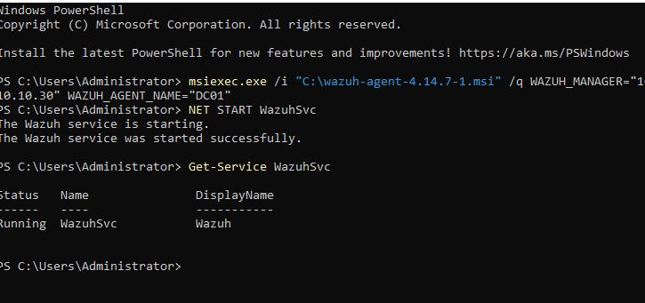

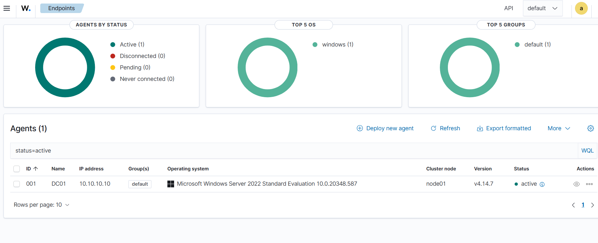

## WIN11-CLIENT

```text
Agent ID: 002
Name: WIN11-CLIENT
IP: 10.10.10.20
Status: Active
```

### Evidence

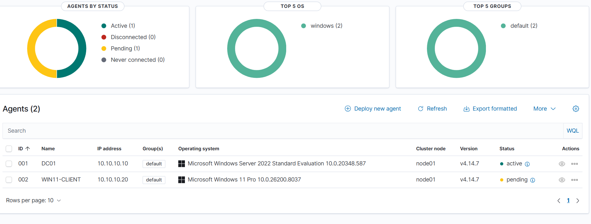

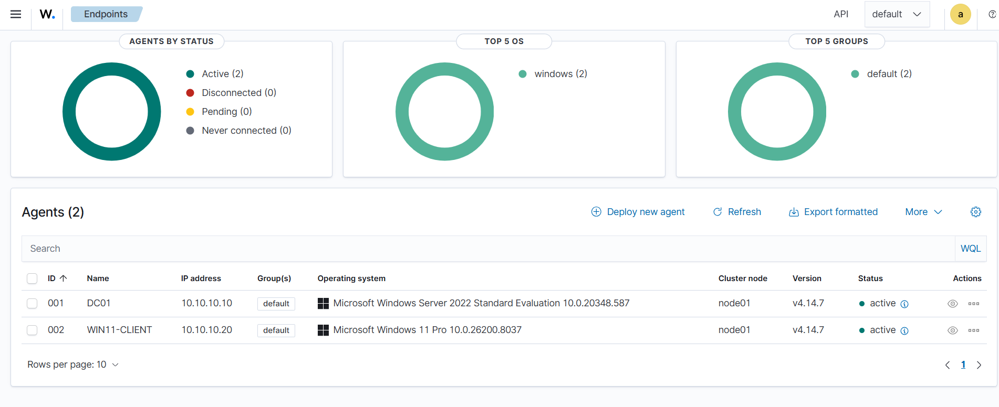

## Dashboard

### Evidence

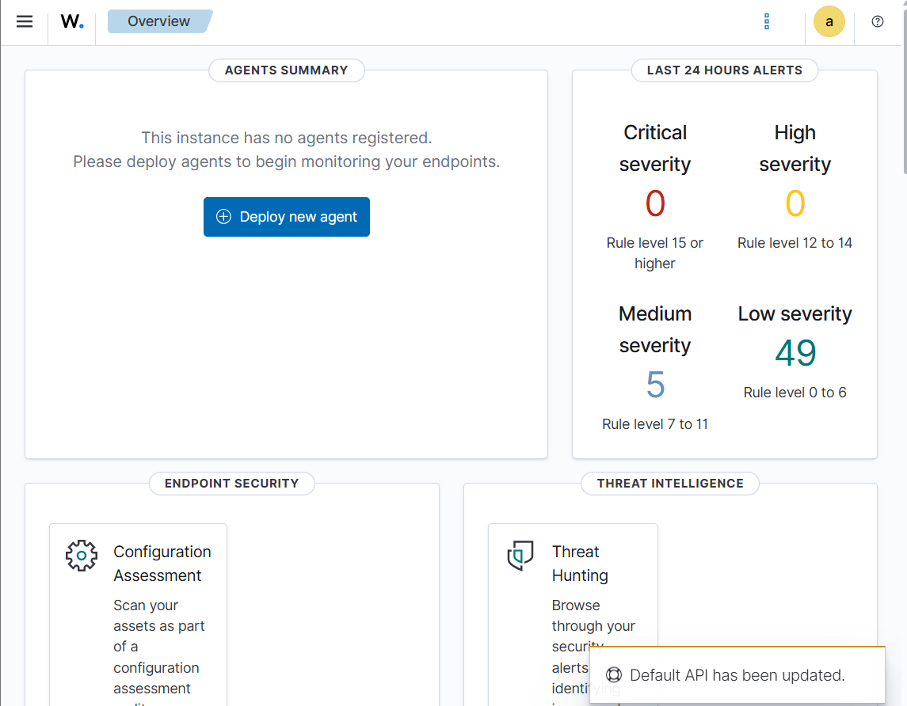

---

# Centralized Wazuh Windows Telemetry

The final centralized configuration is stored in:

```text
configs/wazuh/agent.conf
```

The custom channels are:

```xml
<agent_config os="Windows">

  <localfile>
    <location>Microsoft-Windows-PowerShell/Operational</location>
    <log_format>eventchannel</log_format>
  </localfile>

  <localfile>
    <location>Microsoft-Windows-Sysmon/Operational</location>
    <log_format>eventchannel</log_format>
  </localfile>

</agent_config>
```

The standard Windows Security channel is already monitored by the default Wazuh Windows configuration, so it was removed from the centralized custom configuration after a duplicate-source warning was discovered.

Configuration validation:

```bash
sudo /var/ossec/bin/verify-agent-conf
```

Agent synchronization was checked individually for:

```text
001 — DC01
002 — WIN11-CLIENT
```

---

# Failed Authentication Validation

A controlled failed NTLM authentication was generated from WIN11-CLIENT against DC01.

Windows generated:

```text
4625 — Failed logon
4776 — Credential validation failure
```

Source:

```text
WIN11-CLIENT
10.10.10.20
```

Target:

```text
DC01
10.10.10.10
```

Wazuh generated built-in alerts including:

```text
60122 — Logon Failure - Unknown user or bad password
60104 — Windows audit failure event
```

This validated:

```text
WIN11-CLIENT
      ↓
DC01 Security Log
      ↓
Wazuh Agent
      ↓
Wazuh Manager
      ↓
Detection Alert
```

### Evidence

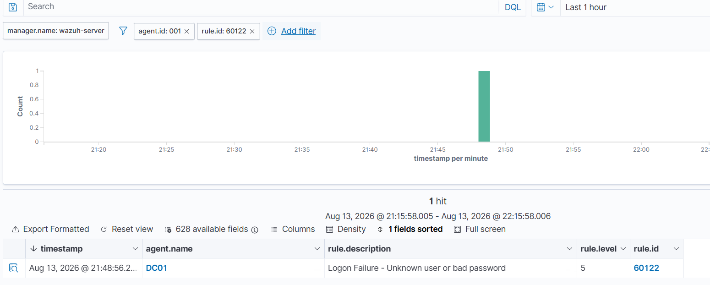

---

# Detection Engineering

The Day 3 detection-engineering phase produced three custom Wazuh detections plus one validated built-in PowerShell detection.

Final custom rules are stored in:

```text
detections/wazuh/local_rules.xml
```

---

# Detection 1 — Kerberoasting

## Detection Goal

Identify suspicious Kerberos service-ticket requests using RC4 encryption for a non-machine account.

## Test

The lab SPN:

```text
HTTP/web.adlab.test
```

is registered to:

```text
svc_web
```

A controlled Kerberos service-ticket request was generated from WIN11-CLIENT.

Commands included:

```cmd
klist purge
klist get HTTP/web.adlab.test
klist
```

DC01 produced:

```text
Event ID: 4769
Service Name: svc_web
Ticket Encryption Type: 0x17
Client Address: 10.10.10.20
```

### Evidence

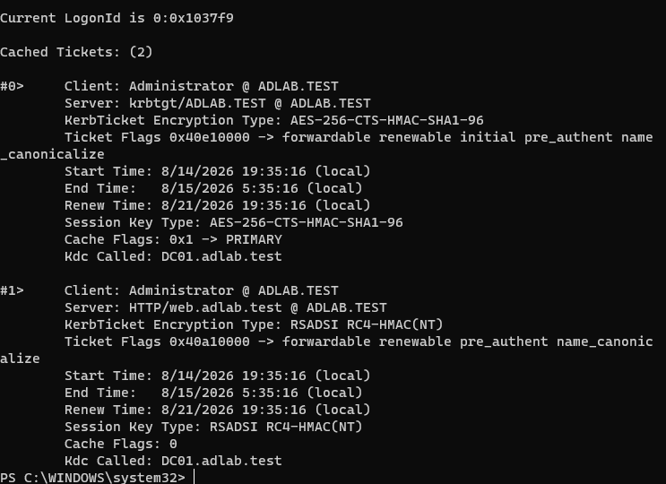

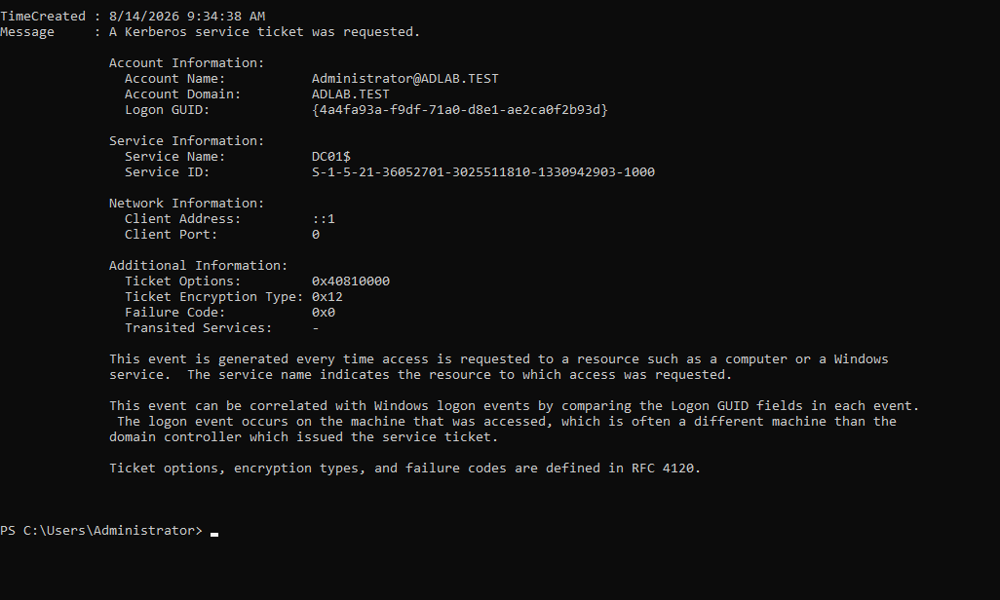

---

## Wazuh Rule 110100

The final rule detects:

- Event ID `4769`
- RC4 ticket encryption `0x17`
- Non-machine requesting account
- Kerberos authentication success context

MITRE ATT&CK:

```text
T1558.003 — Kerberoasting
```

The machine-account exclusion prevents usernames containing `$` from matching.

### Validation Evidence

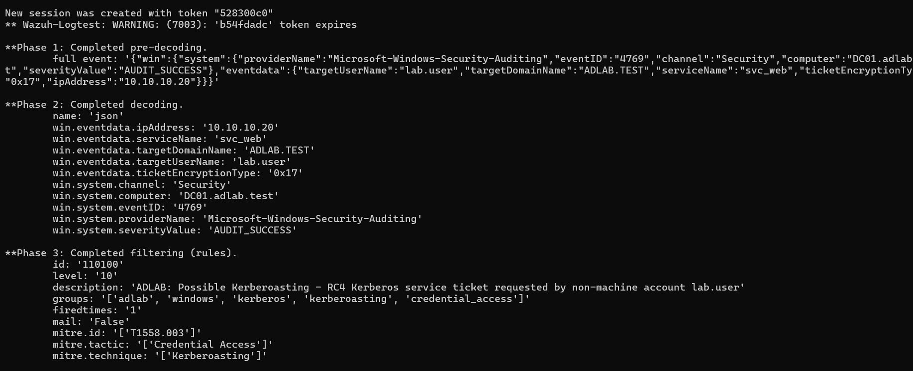

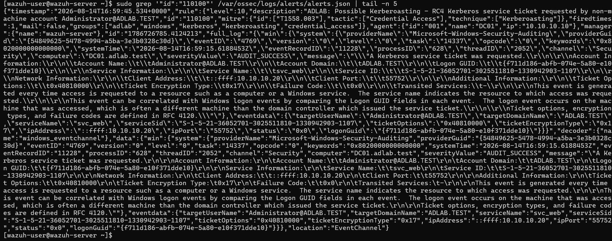

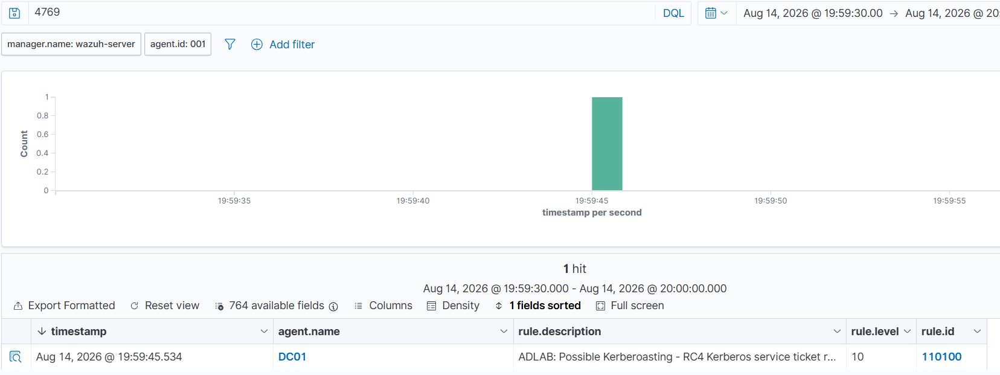

---

# Detection 2 — Password Spraying

## Detection Goal

Detect authentication failures against multiple different accounts from the same source IP within a short time window.

Controlled failed authentications were generated from:

```text
WIN11-CLIENT — 10.10.10.20
```

against multiple lab accounts.

The test intentionally used the same incorrect password across different usernames to simulate password-spray behavior without targeting any external system.

## Wazuh Rule 110110

Correlation logic:

```text
Multiple authentication failures
+ Same source IP
+ Different target usernames
+ Four events
+ 120-second window
```

MITRE ATT&CK:

```text
T1110.003 — Password Spraying
```

The final live rule successfully correlated the failed authentications and produced a level 12 alert.

### Evidence

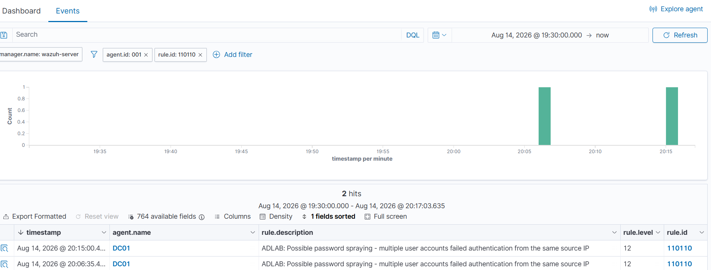

---

# Built-In Detection — Encoded PowerShell

A harmless Base64-encoded PowerShell command was used to test existing Wazuh coverage.

The command executed only:

```text
ADLAB-ENCODED-TEST
```

Sysmon Event ID 1 captured the encoded PowerShell process.

Wazuh built-in rule:

```text
92057
```

generated a:

```text
Level 12
```

alert for PowerShell spawning another PowerShell process with a Base64-encoded command.

MITRE ATT&CK:

```text
T1059.001 — PowerShell
```

Because the existing Wazuh detection already provided useful coverage, a duplicate custom rule was not created.

### Evidence

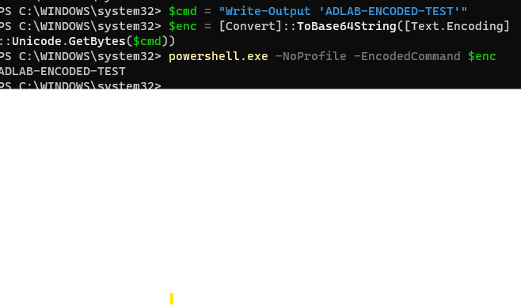

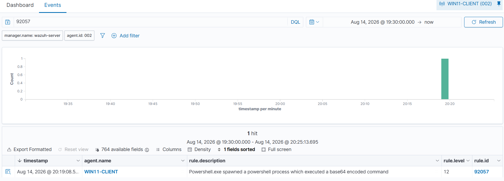

---

# Detection 3 — Suspicious PowerShell Script Block

## Detection Goal

Detect suspicious PowerShell content from Event ID 4104 using the actual script block text rather than only process creation.

## Wazuh Rule 110120

The final custom rule uses:

```text
Event channel: Microsoft-Windows-PowerShell/Operational
Event ID: 4104
Decoded field: win.eventdata.scriptBlockText
Parent Wazuh PowerShell rule: 91802
```

The suspicious-pattern logic includes:

```text
Invoke-Expression
IEX
DownloadString
Net.WebClient
FromBase64String
```

MITRE ATT&CK:

```text
T1059.001 — PowerShell
```

---

## Safe Validation Test

A harmless `.ps1` file containing:

```powershell
Invoke-Expression 'Write-Output "ADLAB-RULE-110120-TEST"'
```

was used.

The system execution policy initially prevented the script from running.

Instead of changing the machine-wide policy, the test was executed in a single PowerShell process using:

```powershell
powershell.exe -NoProfile -ExecutionPolicy Bypass -File $path
```

This generated Event ID 4104 containing the expected script text.

Wazuh received the event and custom rule `110120` fired successfully.

### Evidence


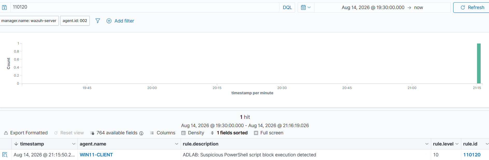

---

# Wazuh / PowerShell Troubleshooting Investigation

The PowerShell 4104 detection required a deeper troubleshooting process and became an important part of the project.

## Problem 1 — No 4104 on WIN11

Initial query:

```powershell
Get-WinEvent -FilterHashtable @{
    LogName='Microsoft-Windows-PowerShell/Operational'
    Id=4104
}
```

returned no events.

### Root Cause

The PowerShell logging GPO existed only on the Domain Controllers OU.

### Resolution

Created:

```text
ADLAB-Workstation-Logging
```

linked to:

```text
OU=Workstations
```

The registry confirmed:

```text
EnableScriptBlockLogging : 1
```

and WIN11 began generating 4104 events.

---

## Problem 2 — No 4104 in alerts.json

WIN11 generated 4104 locally, but the event did not appear in:

```text
/var/ossec/logs/alerts/alerts.json
```

### Investigation

This did not necessarily indicate collection failure because `alerts.json` only contains events that generated alerts.

Raw archive logging was temporarily enabled:

```xml
<logall_json>yes</logall_json>
```

to inspect all received events.

Archive logging was later disabled again after troubleshooting:

```xml
<logall_json>no</logall_json>
```

to prevent unnecessary disk usage.

---

## Problem 3 — Historical Agent Connection Errors

The WIN11 Wazuh agent log showed historical errors such as:

```text
Unable to connect to 10.10.10.30:1514/tcp
Lost connection with manager
Process locked due to agent is offline
```

The manager was checked with:

```bash
sudo systemctl is-active wazuh-manager
sudo ss -lntp | grep 1514
```

and was confirmed:

```text
active
TCP 1514 listening
```

Agent `002` was also confirmed Active.

Current Sysmon forwarding proved the live network path was functioning.

---

## Problem 4 — PowerShell Events Seemed Missing from Archives

A direct `jq` search initially showed no 4104 events.

Further analysis used:

```text
wazuh-logcollector.state
```

on WIN11.

The state file proved Wazuh was collecting:

```text
Microsoft-Windows-PowerShell/Operational
events: 62
drops: 0
```

while simultaneously collecting Sysmon and Security events.

This demonstrated that the endpoint collector was functioning correctly.

---

## Problem 5 — JSON Parsing Errors

Because:

```text
archives.json
```

was being actively written while `jq` was reading it, normal parsing occasionally returned:

```text
jq: parse error: Unfinished string at EOF
```

The investigation switched to line-by-line parsing:

```text
jq -R
fromjson?
```

which safely ignored temporarily incomplete lines.

This revealed the actual PowerShell Operational events.

A count of received event IDs showed:

```text
40961
40962
4100
4104
53504
```

including:

```text
32 Event ID 4104 records
```

---

## Problem 6 — Determining the Correct Wazuh Field

A full raw Event 4104 was extracted.

Wazuh decoded the actual script content into:

```text
win.eventdata.scriptBlockText
```

Example:

```text
scriptBlockText: "$global:?"
```

This eliminated guesswork and allowed the final custom rule to use the real decoded field.

---

## Problem 7 — First Suspicious PowerShell Test Did Not Trigger

An early `Invoke-Expression` test failed to produce the expected new 4104 record.

The issue was not the Wazuh detection rule; the intended script text had not been generated in the local 4104 event.

A real `.ps1` test file was then used.

Execution was initially blocked by PowerShell execution policy.

A process-scoped bypass was used only for the controlled lab test.

The resulting 4104 events contained:

```text
Invoke-Expression 'Write-Output "ADLAB-RULE-110120-TEST"'
```

The event arrived in Wazuh and rule `110120` fired.

---

## Problem 8 — Duplicate Security Log Collection

After centralized `agent.conf` was deployed, the agent log reported:

```text
WARNING: Log file 'Security' is duplicated.
```

The cause was that Windows Security was already collected by the default Wazuh Windows agent configuration while it was also defined in the custom centralized configuration.

The duplicate custom `Security` block was removed.

The final agent startup showed clean collection of:

```text
Microsoft-Windows-PowerShell/Operational
Microsoft-Windows-Sysmon/Operational
```

without a new duplicate Security warning.

---

## Problem 9 — Temporary Debug Logging

Temporary Windows-agent debug logging was enabled during troubleshooting.

After the problem was resolved, the debug override was removed and the Wazuh service was restarted.

This ensures the final configuration does not generate unnecessary verbose logs.

---

# Final Day 3 Detection Summary

| Rule | Detection | Source | Level | MITRE | Status |
|---|---|---|---:|---|---|
| `110100` | RC4 Kerberos service ticket / Kerberoasting | Windows 4769 | 10 | `T1558.003` | ✅ Validated |
| `110110` | Password spray correlation | Windows authentication failures | 12 | `T1110.003` | ✅ Validated |
| `110120` | Suspicious PowerShell script block | PowerShell 4104 | 10 | `T1059.001` | ✅ Validated |
| `92057` | Encoded PowerShell | Sysmon / PowerShell process | 12 | `T1059.001` | ✅ Built-in validated |
| `60122` | Failed logon | Windows 4625 | 5 | Authentication | ✅ Built-in validated |
| `60104` | Windows audit failure | Windows 4776 | 5 | Authentication | ✅ Built-in validated |

---

# Current Telemetry Coverage

## Windows Security

```text
4624 — Successful logon
4625 — Failed logon
4672 — Special privileges assigned
4688 — Process creation
4728 — Global security group membership change
4732 — Local security group membership change
4756 — Universal security group membership change
4768 — Kerberos TGT request
4769 — Kerberos service ticket request
4771 — Kerberos pre-authentication failure
4776 — Credential validation
```

## PowerShell

```text
4104 — Script Block Logging
```

## Sysmon

```text
1  — Process Creation
3  — Network Connection
11 — File Creation
22 — DNS Query
```

---

# Evidence Index

## Day 1

```text
screenshots/day1-virtualbox-ad-lab-network.png
screenshots/day1-dc01-ip-hostname.png
screenshots/day1-domain-controller.png
```

## Day 2

```text
screenshots/day2-ou-structure.png
screenshots/day2-svc-web-spn.png
screenshots/day2-domain-join.png
screenshots/day2-domain-user-login.png
screenshots/day2-workstation-ou.png
```

## Day 3 — Auditing / PowerShell / Sysmon

```text
screenshots/day3-audit-policy-1.png
screenshots/day3-audit-policy-2.png
screenshots/day3-dc01-gpo-result.png
screenshots/day3-powershell-test-command.png
screenshots/day3-powershell-4104-event.png
screenshots/day3-win11-workstation-logging-gpo.png
screenshots/day3-win11-powershell-4104.png
screenshots/day3-sysmon-win11-running.png
screenshots/day3-sysmon-win11-event1.png
screenshots/day3-sysmon-win11-dns-event22.png
screenshots/day3-sysmon-dc01-event1.png
screenshots/day3-sysmon-dc01-config-validation.png
```

## Day 3 — Wazuh

```text
screenshots/day3-wazuh-dashboard.png
screenshots/day3-wazuh-dc01-agent-deployment.png
screenshots/day3-wazuh-dc01-agent-running.png
screenshots/day3-wazuh-dc01-agent-active.png
screenshots/day3-wazuh-agents-status.png
screenshots/day3-wazuh-all-agents-active.png
screenshots/day3-wazuh-failed-logon-detection.png
```

## Day 3 — Detection Engineering

```text
screenshots/day3-kerberos-service-ticket.png
screenshots/day3-kerberoasting-event4769-rc4.png
screenshots/day3-wazuh-kerberoasting-rule-logtest.png
screenshots/day3-wazuh-kerberoasting-live-detection.png
screenshots/day3-wazuh-kerberoasting-dashboard-alert.png
screenshots/day3-wazuh-password-spray-dashboard-alert.png
screenshots/day3-encoded-powershell-test-command.png
screenshots/day3-wazuh-encoded-powershell-dashboard-alert.png
screenshots/day3-wazuh-suspicious-powershell-dashboard-alert.png
```

Two screenshots from the abandoned manual Wazuh installation are intentionally excluded from final evidence:

```text
day3-wazuh-adlab-connectivity.png
day3-wazuh-networking.png
```

They do not represent the final architecture.

---

# Current Repository Structure

```text
active-directory-attack-detection-lab/
│
├── README.md
│
├── automation/
│   └── create-lab-users.ps1
│
├── configs/
│   ├── sysmon/
│   │   └── sysmon-config.xml
│   │
│   ├── windows-auditing/
│   │   ├── advanced-audit-policy.md
│   │   └── powershell-logging.md
│   │
│   └── wazuh/
│       └── agent.conf
│
├── detections/
│   ├── wazuh/
│   │   └── local_rules.xml
│   │
│   └── sigma/
│
├── dashboards/
├── diagrams/
├── screenshots/
├── reports/
└── docs/
```

The old incorrectly named:

```text
agent.conf.txt
local_rules.xml.txt
```

files were replaced by their proper configuration file extensions.

---

# Security and Authorization

All activity is performed exclusively inside the isolated:

```text
AD-LAB
```

VirtualBox environment using systems and accounts deliberately created for this project.

The lab does **not** target:

- External companies
- University infrastructure
- Public services
- Home-network devices outside the lab
- Any system without explicit authorization

No real credentials are used.

The repository does not intentionally contain:

- Real passwords
- DSRM passwords
- Domain Administrator passwords
- API keys
- Tokens
- Private keys
- Enrollment secrets
- VM disk images
- ISO files
- Personal documents

---

# Additional Troubleshooting & Lessons Learned

## Windows Server Edition

The first Windows Server installation used Server Core.

The VM was rebuilt using:

```text
Windows Server 2022
Desktop Experience
```

to support the management tooling needed for the project.

## Windows 11 Installation / Networking

WIN11 initially encountered installation and network-driver / OOBE issues.

The final system was configured as Windows 11 Pro and joined successfully to the AD domain.

## Active Directory DNS Registration

Temporary VirtualBox network interfaces caused DC01 to register unwanted DNS addresses.

Those records were removed so clients resolve the Domain Controller only through the isolated lab network.

## Standard vs Administrative Accounts

Normal user accounts remain standard users.

Privileged configuration is performed only when required, while attack/detection validation uses normal lab identities wherever possible.

## Sysmon Configuration Filename

Windows initially saved:

```text
sysmon-config.xml
```

as:

```text
sysmon-config.xml.txt
```

The issue was corrected before the configuration was applied.

## Manual Wazuh Installation Failure

A manual Ubuntu Wazuh installation was attempted first.

Repeated dashboard-package / storage-I/O problems made the build unreliable.

The project switched to the official Wazuh OVA rather than documenting an unstable platform as the final SIEM architecture.

This was treated as an infrastructure troubleshooting decision rather than hidden as a failure.

## VirtualBox Networking

Wazuh required a more flexible network layout than the Windows attack-lab machines.

The final appliance uses:

- Internal `AD-LAB` for SIEM-to-agent communication
- Host-only for management
- Bridged connectivity for appliance Internet access

The Windows lab endpoints remain isolated from the external network.

---

# Detection Validation Philosophy

A Windows event appearing in Event Viewer is not considered a completed detection.

Each scenario follows:

```text
Controlled Action
        ↓
Raw Windows / Sysmon Telemetry
        ↓
Wazuh Ingestion
        ↓
Detection Rule
        ↓
Alert
        ↓
Analyst Investigation
        ↓
False-Positive Analysis
        ↓
Tuning
        ↓
Mitigation / Hardening
```

For each detection, the project aims to record:

- Expected telemetry
- Observed telemetry
- Rule logic
- MITRE ATT&CK mapping
- Alert result
- Approximate latency
- False-positive considerations
- Tuning decisions
- Evidence
- Final validation status

Possible statuses:

```text
Detected
Partially Detected
Logged but Not Alerted
Not Observed
```

A missing alert is treated as a **detection-engineering gap to investigate**, not something to hide.

The PowerShell 4104 investigation is an example of this process: the event was traced from GPO configuration, through local Windows logging, Wazuh agent collection, raw archive inspection, decoded field analysis, and finally to a working custom rule.

---

# MITRE ATT&CK Coverage So Far

| Technique | ID | Lab Validation |
|---|---|---|
| Kerberoasting | `T1558.003` | Custom rule 110100 |
| Password Spraying | `T1110.003` | Custom rule 110110 |
| PowerShell | `T1059.001` | Custom rule 110120 + built-in 92057 |

Additional ATT&CK mappings will be added only when supported by actual controlled lab behavior.

---

# Planned Next Phases

## Benign Noise Automation

Planned files:

```text
automation/benign-noise.ps1
automation/scheduled-task-setup.ps1
```

Potential normal background activity:

- DNS queries
- ICMP connectivity checks
- SYSVOL reads
- NETLOGON reads
- Low-rate internal requests

Goals:

- Measure false positives
- Evaluate alert quality
- Tune thresholds
- Demonstrate detections operating in a noisy environment

---

## Additional Detection Scenarios

Planned work includes:

1. Active Directory / network reconnaissance
2. Remote logon / lateral-movement-like activity
3. Privileged group membership modification
4. Canary-account authentication attempts
5. Targeted directory-object auditing
6. Additional hardening / before-and-after validation

---

# Planned Sigma Rules

```text
detections/sigma/
├── kerberoasting.yml
├── password-spray.yml
├── suspicious-powershell.yml
├── privileged-group-change.yml
└── canary-account.yml
```

Sigma rules will only be marked validated after comparison with the actual working Wazuh detection behavior.

---

# Final Goal

The completed project is designed to demonstrate practical experience with:

- Active Directory administration
- Windows authentication
- Kerberos
- DNS
- Group Policy
- Windows Security Event Logs
- PowerShell telemetry
- Sysmon
- Wazuh SIEM
- Detection engineering
- Correlation rules
- Threat hunting
- MITRE ATT&CK
- Alert validation
- False-positive tuning
- Troubleshooting
- Identity hardening
- Sigma
- Security documentation
- Git-based detection-as-code

---

## Current Milestone

```text
DC01          ✅ AD DS + DNS + Auditing + PowerShell + Sysmon + Wazuh Agent
WIN11-CLIENT  ✅ Domain Joined + Workstation GPO + PowerShell + Sysmon + Wazuh Agent
WAZUH         ✅ Manager + Indexer + Dashboard + Centralized Telemetry
KALI          ⏳ Pending
```

### Validated detections

```text
110100  ✅ Kerberoasting
110110  ✅ Password Spraying
110120  ✅ Suspicious PowerShell Script Block
92057   ✅ Encoded PowerShell (built-in)
60122   ✅ Failed Logon (built-in)
60104   ✅ Windows Audit Failure (built-in)
```

**Day 3 is complete. The next milestone is controlled attack simulation, additional identity detections, background-noise testing, Sigma conversion, and hardening validation.**
