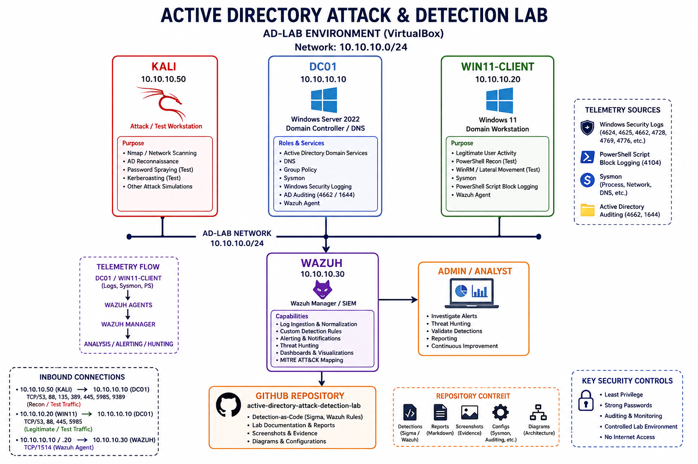
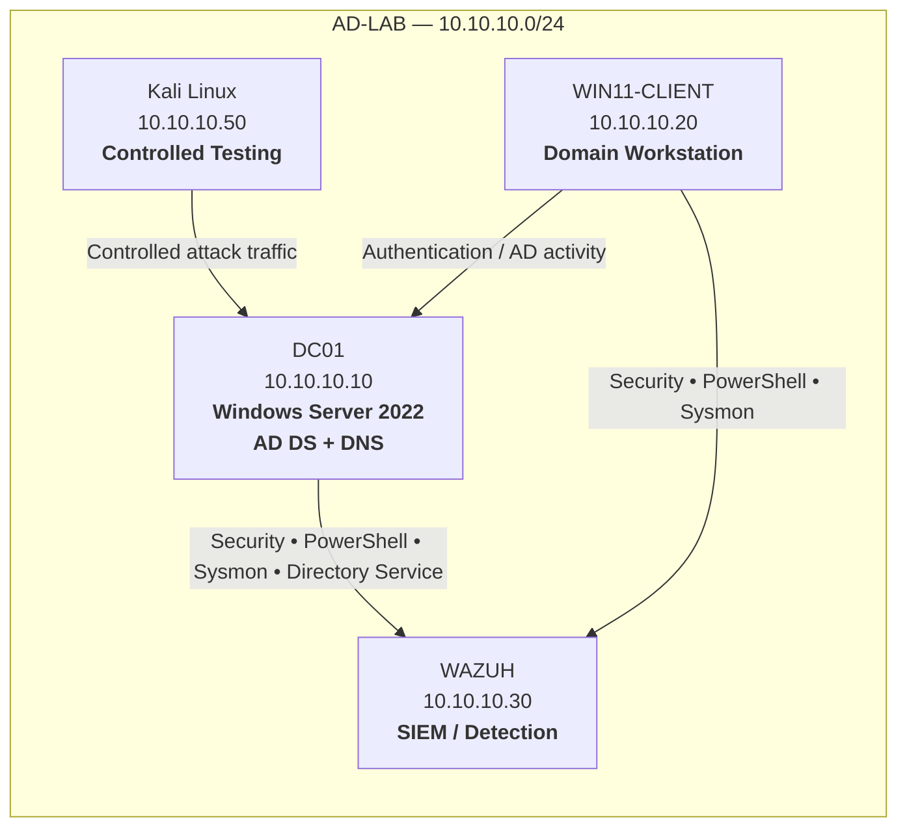
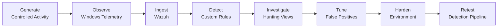
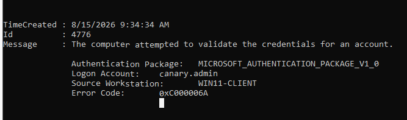
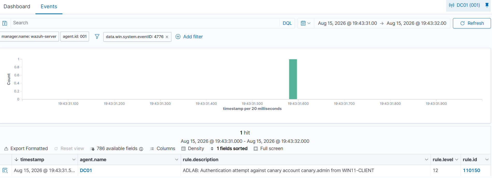

<div align="center">

# 🛡️ Active Directory Attack & Detection Lab

### Detection Engineering • Windows Security • SIEM • Threat Hunting

**An end-to-end Active Directory detection engineering lab built around real Windows telemetry, custom Wazuh rules, Sigma detections, false-positive validation, hardening, and post-remediation retesting.**


**Windows Server 2022 • Active Directory • Windows 11 • Kali Linux • Sysmon • Wazuh • Sigma • PowerShell**

</div>

---

## 📌 Project Overview

This project builds an isolated **Active Directory environment in VirtualBox** and uses controlled attack simulations to generate real Windows security telemetry.

The focus is **detection engineering**, not simply offensive testing.

The lab follows the complete workflow:

```text
Generate → Observe → Ingest → Detect → Investigate → Tune → Harden → Retest
```

The environment was used to simulate and investigate:

- Network and Active Directory reconnaissance
- Password spraying and failed authentication
- Kerberoasting
- Suspicious PowerShell reconnaissance
- Remote administrative logons
- Privileged-group membership changes
- Canary-account authentication
- Active Directory object auditing
- LDAP diagnostic telemetry
- Benign enterprise-like background traffic

Custom **Wazuh detections**, **Sigma rules**, hunting views, false-positive testing, hardening, and post-hardening validation were added to turn the environment into a practical detection-engineering portfolio project.

---

## 🏆 Project Highlights

| Capability | Result |
|---|---|
| Active Directory domain deployment | ✅ Completed |
| Windows endpoint telemetry | ✅ Sysmon + Security Events + PowerShell |
| SIEM ingestion | ✅ Wazuh |
| Custom Wazuh detection rules | ✅ 5 validated custom rules |
| Sigma detection-as-code | ✅ Implemented |
| Threat hunting workflows | ✅ Documented |
| Canary identity tripwire | ✅ Validated |
| Benign-noise testing | ✅ Performed |
| False-positive validation | ✅ Performed |
| Security hardening | ✅ Completed |
| Post-hardening regression test | ✅ Detection remained operational |
| Documented detection gaps | ✅ Remote logon + LDAP 1644 gaps retained |

---

## 🏗️ Architecture





### Systems

| System | Role | IP Address |
|---|---|---|
| **DC01** | Windows Server 2022 / Domain Controller / DNS | `10.10.10.10` |
| **WIN11-CLIENT** | Windows 11 domain workstation | `10.10.10.20` |
| **WAZUH** | Wazuh Manager / SIEM | `10.10.10.30` |
| **KALI** | Controlled testing workstation | `10.10.10.50` |

### Active Directory

```text
Domain:            adlab.test
NetBIOS:           ADLAB
Domain Controller: DC01
Network:           10.10.10.0/24
```

---

## 🔄 Detection Engineering Workflow



---

## 🔐 Authorization & Scope

All activity in this repository was performed against systems deliberately created inside a private VirtualBox lab.

> **No production systems, public infrastructure, real organisations, or real credentials were targeted.**

### Intentionally Excluded

The project does **not** include destructive or unnecessarily high-risk techniques such as:

- Credential dumping from LSASS
- DCSync
- Golden Ticket
- Silver Ticket
- Ransomware
- Destructive payloads
- Persistence or evasion against real systems

---

## 📊 Project Status

| Component | Status |
|---|---|
| Active Directory domain | ✅ Complete |
| Windows 11 domain join | ✅ Complete |
| Advanced Windows auditing | ✅ Complete |
| Sysmon deployment | ✅ Complete |
| PowerShell Script Block Logging | ✅ Complete |
| Wazuh Windows agents | ✅ Complete |
| Network reconnaissance test | ✅ Complete |
| Password-spray test | ✅ Complete |
| Kerberoasting test | ✅ Complete |
| PowerShell reconnaissance test | ✅ Complete |
| Remote logon test | ✅ Complete |
| Privileged-group change test | ✅ Complete |
| Canary account tripwire | ✅ Complete |
| Event ID 4662 targeted auditing | ✅ Complete |
| LDAP Event ID 1644 | 🟡 Local telemetry validated; Wazuh ingestion gap |
| Custom Wazuh detections | ✅ Complete |
| Sigma detection-as-code | ✅ Complete |
| Wazuh hunting views | ✅ Complete |
| Benign-noise automation | ✅ Complete |
| False-positive validation | ✅ Complete |
| Detection validation matrix | ✅ Complete |
| Hardening | ✅ Complete |
| Post-hardening retest | ✅ Complete |

---

# 🔭 Telemetry Coverage

The lab combines native Windows logging with endpoint and identity telemetry.

## Windows Security Events

| Event ID | Purpose |
|---:|---|
| `4624` | Successful logon |
| `4625` | Failed logon |
| `4648` | Explicit credential use |
| `4662` | Audited Active Directory object access |
| `4672` | Special privileges assigned |
| `4688` | Process creation |
| `4728` | Member added to global security group |
| `4732` | Member added to local security group |
| `4756` | Member added to universal security group |
| `4768` | Kerberos TGT request |
| `4769` | Kerberos service-ticket request |
| `4771` | Kerberos pre-authentication failure |
| `4776` | Credential validation |
| `5136` | Directory service object modification |
| `5140 / 5145` | SMB / share activity |

## PowerShell

```text
4104 — PowerShell Script Block Logging
```

Used to inspect executed PowerShell content and contextualise suspicious Active Directory enumeration.

## Sysmon

```text
1  — Process Create
3  — Network Connection
11 — File Create
22 — DNS Query
```

## Directory Service

```text
4662 — Audited Active Directory object access
1644 — LDAP diagnostic query telemetry
```

---

# 🎯 Detection Scenarios

## 01 — Network / AD Reconnaissance

Controlled reconnaissance was performed from Kali against the isolated AD-LAB environment.

```bash
nmap -sV -Pn 10.10.10.10
```

The activity was used to identify exposed services on DC01 and validate network-service-discovery detection.

### Result

> ✅ **Detected — Custom Wazuh Rule `110130`**

The detection was tested while benign enterprise-like background traffic was running.

**No observed false-positive match from WIN11-CLIENT background activity occurred during the validation window.**

---

## 02 — Password Spraying / Failed Authentication

A small number of controlled failed login attempts were generated against dummy AD-LAB users without intentionally locking accounts.

Relevant telemetry:

```text
4625
4771
4776
```

### Result

> ✅ **Detected — Custom Wazuh Rule `110110`**

The rule demonstrates how frequency, source system, and affected accounts can help distinguish suspicious authentication patterns from isolated user mistakes.

---

## 03 — Kerberoasting

A deliberately configured service account was created:

```text
svc_web
```

With the SPN:

```text
HTTP/web.adlab.test
```

The controlled service-ticket request generated:

```text
Event ID 4769
```

### Result

> ✅ **Detected — Custom Wazuh Rule `110100`**

Investigation context included:

- Requesting account
- Service name
- Source host
- Ticket encryption information
- SPN
- Timestamp

Normal `4769` events were also observed, demonstrating why context is necessary before treating every Kerberos service-ticket request as malicious.

After testing, the deliberately weak `svc_web` password was replaced with a strong lab-only password.

---

## 04 — Suspicious PowerShell Reconnaissance

Controlled PowerShell Active Directory enumeration was performed.

```powershell
Get-ADDomain
Get-ADUser -Filter *
Get-ADGroup -Filter *
Get-ADGroupMember "Domain Admins"
```

### Result

> ✅ **Detected — Custom Wazuh Rule `110120`**

PowerShell itself is not considered malicious. Detection confidence depends on:

- User
- Host
- Command content
- Frequency
- Breadth of enumeration
- Surrounding activity

---

## 05 — Controlled Remote Logon

PowerShell Remoting over WinRM was used from:

```text
WIN11-CLIENT — 10.10.10.20
```

to:

```text
DC01 — 10.10.10.10
```

DC01 generated:

```text
Event ID:       4624
Logon Type:     3
Account:        Administrator
Source IP:      10.10.10.20
Authentication: Kerberos
```

### Result

> 🟡 **Logged, but the exact Wazuh alert was not confirmed**

The correct raw Windows event was observed, but the exact DC01 Type-3 remote administrative logon could not be confirmed as a corresponding Wazuh alert.

This is documented as a **detection-engineering gap**, rather than overstating the result.

See:

```text
reports/test-05-lateral-movement.md
```

---

## 06 — Privileged Group Membership Change

The `helpdesk.test` account was temporarily added to:

```text
Domain Admins
```

Windows generated:

```text
Event ID 4728
```

Wazuh generated:

```text
Rule ID:          60159
Rule Description: Domain Admins Group Changed
Level:            12
```

### Result

> ✅ **Detected**

After evidence collection, `helpdesk.test` was immediately removed from Domain Admins.

---

# 🚨 Canary Identity Tripwire

A dedicated high-signal identity was created:

```text
canary.admin
```

The account is:

- Disabled
- Non-privileged
- Never used for legitimate administration

A controlled authentication attempt generated:

```text
Event ID:           4776
Target Account:     canary.admin
Source Workstation: WIN11-CLIENT
```

Custom Wazuh detection:

```text
Rule ID: 110150
Level:   12
```

### Result

> ✅ **Detected and successfully revalidated after hardening**

Because no legitimate workflow should authenticate as this account, it provides an extremely low expected false-positive rate.

---

# 🧬 Targeted Active Directory Auditing

Advanced Directory Service Access auditing was configured.

A SACL was applied to:

```text
Test-Lab OU
```

A harmless object operation successfully generated:

```text
Event ID 4662
```

### Key Finding

> **Audit policy alone was not enough.**

Event `4662` required:

```text
Audit Policy + Object SACL
```

This demonstrates the relationship between Windows audit policy and object-level Active Directory auditing.

---

# 🔎 LDAP Diagnostic Visibility

Temporary LDAP Field Engineering diagnostics were enabled on DC01.

A controlled LDAP query generated:

```text
Event ID 1644
```

The event was successfully confirmed in the local **Directory Service** event log.

### Result

> 🟡 **Local telemetry validated / Wazuh ingestion gap**

The event was not successfully confirmed in Wazuh.

Verbose diagnostic logging was disabled immediately after testing.

---

# 🧠 Custom Wazuh Detections

Detection engineering was performed using actual decoded lab telemetry.

| Rule ID | Detection | Status |
|---:|---|---|
| `110100` | Kerberoasting | ✅ Validated |
| `110110` | Password spraying / failed authentication | ✅ Validated |
| `110120` | PowerShell AD reconnaissance | ✅ Validated |
| `110130` | Network service discovery / Nmap | ✅ Validated |
| `110150` | Canary-account authentication | ✅ Validated |

Rules are stored under:

```text
detections/wazuh/
```

Wazuh rule testing was also validated with:

```bash
/var/ossec/bin/wazuh-logtest
```

---

# 📐 Sigma Detection-as-Code

Vendor-neutral Sigma rules are stored under:

```text
detections/sigma/
```

Implemented detections:

```text
kerberoasting.yml
powershell-ad-recon.yml
privileged-group-change.yml
```

> **Sigma is used as the portable detection specification. Wazuh XML rules are the operational SIEM implementation.**

The project does **not** claim that storing Sigma YAML files automatically causes Wazuh to execute them.

---

# 🔍 Threat Hunting Views

Repeatable Wazuh hunting workflows are documented in:

```text
dashboards/wazuh-saved-searches.md
```

| Hunt | Events / Rule |
|---|---|
| Authentication | `4624`, `4625`, `4771`, `4776` |
| Kerberos | `4769` |
| PowerShell | `4104` |
| Privileged Group Changes | `4728`, `4732`, `4756` |
| Active Directory Objects | `4662`, `5136` |
| Canary Authentication | `rule.id:110150` |
| Network Reconnaissance | `rule.id:110130` |

These provide a repeatable analyst workflow instead of relying only on isolated screenshots.

---

# 🌐 Benign Enterprise Noise

A PowerShell automation script generated low-rate normal activity from WIN11-CLIENT.

The activity included:

- DNS resolution
- ICMP reachability
- SYSVOL reads
- NETLOGON reads
- Normal PowerShell execution

Source:

```text
automation/benign-noise.ps1
```

The objective was to evaluate detection quality while normal background activity was present.

## False-Positive Validation

| Detection | Suspicious Activity Detected | Benign False Positive Observed |
|---|---:|---:|
| Network reconnaissance / Nmap | ✅ | No |
| Canary authentication / Rule 110150 | ✅ | No |

This provides stronger validation than testing detections against an otherwise silent environment.

See:

```text
reports/noise-baseline.md
```

---

# ✅ Detection Validation Matrix

The complete validation matrix is available at:

```text
reports/detection-validation-matrix.md
```

| Detection | Expected Telemetry | Result |
|---|---|---|
| Network reconnaissance | Network / Sysmon | ✅ Detected |
| Password spraying | 4625 / 4771 / 4776 | ✅ Detected |
| Kerberoasting | 4769 | ✅ Detected |
| PowerShell reconnaissance | 4104 / Sysmon | ✅ Detected |
| Remote administrative logon | 4624 Type 3 | 🟡 Logged but not alerted |
| Privileged-group change | 4728 | ✅ Detected |
| Canary authentication | 4776 | ✅ Detected |
| AD object access | 4662 | ✅ Telemetry validated |
| LDAP diagnostics | 1644 | 🟡 Wazuh ingestion gap |

---

# 🧱 Hardening

After testing, the environment was returned to a safer state while preserving visibility.

## Service Account

**Before**

```text
svc_web
Deliberately weak lab password
SPN configured
```

**After**

- Password replaced with a strong unique lab password
- Account remained non-administrative
- Membership verified as `Domain Users`

## Privileged Membership

`helpdesk.test` was removed from:

```text
Domain Admins
```

## Canary Account

```text
canary.admin
Enabled: False
```

The canary identity remains disabled and non-privileged.

## LDAP Diagnostics

Temporary:

```text
15 Field Engineering = 5
```

Final:

```text
15 Field Engineering = 0
```

The temporary LDAP search threshold was also removed.

## Monitoring Retained

```text
Sysmon DC01          Running
Sysmon WIN11-CLIENT  Running
Wazuh DC01           Running
Wazuh WIN11-CLIENT   Running
```

---

# 🔁 Post-Hardening Retest

After hardening, the canary-account detection was executed again.

```text
Custom Rule: 110150
```

### Result

> ✅ **Detection pipeline remained operational after remediation**

This demonstrated that intentionally introduced weaknesses could be removed without disabling monitoring.

---

# 📈 Before vs After

| Control | Test State | Hardened State |
|---|---|---|
| `svc_web` password | Weak lab-only password | Strong unique password |
| `svc_web` privilege | Standard SPN account | Least privilege retained |
| `helpdesk.test` | Temporarily Domain Admin | Removed |
| `canary.admin` | Disabled | Remains disabled |
| LDAP diagnostics | Temporarily verbose | Disabled |
| Windows auditing | Enabled | Retained |
| PowerShell logging | Enabled | Retained |
| Sysmon | Active | Retained |
| Wazuh | Active | Retained |
| Benign noise | Active for validation | Stopped after testing |

---

# 💡 Key Findings

### 1. Raw telemetry is not the same as an alert

The remote WinRM test generated the expected Windows Event `4624` Logon Type `3`, but no exact corresponding Wazuh alert was confirmed.

### 2. Detection context matters

Event `4769` occurs frequently during normal Active Directory operation. Kerberos detections require contextual fields rather than blindly alerting on every service-ticket request.

### 3. Canary identities provide high-signal detection

Because `canary.admin` is disabled and never legitimately used, authentication attempts provide strong detection confidence.

### 4. AD auditing requires object-level configuration

Event `4662` required both the correct audit policy and an SACL on the monitored Active Directory object.

### 5. Telemetry gaps should be documented

LDAP Event `1644` was generated locally but was not successfully confirmed in Wazuh.

### 6. False-positive validation matters

Testing while benign enterprise-like traffic was active provided a more realistic measure of detection quality.

---

# 📸 Evidence

Representative evidence captured during the project:

```text
screenshots/day3-sysmon-dc01-event1.png
screenshots/day3-powershell-4104-event.png
screenshots/test-01-recon.png
screenshots/test-02-password-failures.png
screenshots/test-03-kerberoasting.png
screenshots/test-04-powershell.png
screenshots/test-05-remote-logon-4624.png
screenshots/test-06-group-change-4728.png
screenshots/test-06-domain-admins-wazuh-rule-60159.png
screenshots/advanced-canary-account-4776.png
screenshots/advanced-canary-custom-rule-110150.png
screenshots/day3-ldap-1644.png
screenshots/day3-wazuh-hunting-kerberos.png
screenshots/day3-wazuh-hunting-powershell.png
screenshots/day7-hardening-account-state.png
screenshots/day7-retest-canary-detection.png
screenshots/day7-canary-noise-validation.png
```

### Example Evidence Gallery

<table>
<tr>
<td width="50%">

**PowerShell Telemetry**


</td>
<td width="50%">

**Kerberoasting Detection**


</td>
</tr>
<tr>
<td width="50%">

**Canary Authentication**



</td>
<td width="50%">

**Custom Canary Rule**



</td>
</tr>
</table>

---

# 📁 Repository Structure

```text
active-directory-attack-detection-lab/
│
├── README.md
├── .gitignore
│
├── diagrams/
│   ├── architecture.png
│   └── architecture-detailed.png
│
├── automation/
│   ├── benign-noise.ps1
│   └── scheduled-task-setup.ps1
│
├── configs/
│   ├── sysmon/
│   │   └── sysmon-config.xml
│   ├── windows-auditing/
│   │   ├── advanced-audit-policy.md
│   │   ├── directory-service-sacl.md
│   │   ├── powershell-logging.md
│   │   └── ldap-1644.md
│   └── wazuh/
│       └── agent-log-channels.md
│
├── detections/
│   ├── wazuh/
│   │   └── local_rules.xml
│   └── sigma/
│       ├── kerberoasting.yml
│       ├── powershell-ad-recon.yml
│       └── privileged-group-change.yml
│
├── dashboards/
│   └── wazuh-saved-searches.md
│
├── reports/
│   ├── test-01-reconnaissance.md
│   ├── test-02-password-spray.md
│   ├── test-03-kerberoasting.md
│   ├── test-04-powershell.md
│   ├── test-05-lateral-movement.md
│   ├── test-06-privilege-change.md
│   ├── detection-validation-matrix.md
│   ├── noise-baseline.md
│   └── final-summary.md
│
├── screenshots/
│   └── project evidence
│
└── docs/
    └── final-project-report.pdf
```

---

# ⚠️ Limitations

This project intentionally has several limitations:

- Local VirtualBox environment
- Single domain controller
- Small number of users and endpoints
- No enterprise EDR
- No SOAR platform
- No production identity-governance platform
- Simplified network architecture
- No destructive attacks
- No credential dumping
- No DCSync
- No Golden / Silver Ticket testing
- LDAP 1644 Wazuh ingestion was not successfully confirmed
- Remote Type-3 logon was logged but no exact Wazuh alert was confirmed

These limitations are documented intentionally to avoid overstating the project.

---

# 🚀 Future Improvements

Potential extensions include:

- Add a second domain controller
- Add Windows Event Forwarding
- Add CI validation for Wazuh and Sigma rules
- Add an internal file server
- Implement a Group Managed Service Account
- Compare gMSA monitoring with traditional service accounts
- Add an EDR platform
- Add Microsoft Defender for Identity
- Translate Sigma rules to another SIEM
- Improve Directory Service Event 1644 ingestion
- Create a dedicated privileged Type-3 remote-logon detection
- Expand benign-noise profiles
- Add regression testing for detection changes

---

# 🧰 Skills Demonstrated

<div align="center">


</div>

- Active Directory administration
- Windows security auditing
- Kerberos authentication
- Windows Event Logs
- Sysmon
- PowerShell logging
- Wazuh SIEM
- Detection engineering
- Custom SIEM rules
- Sigma
- Threat hunting
- MITRE ATT&CK
- Authentication investigation
- Active Directory auditing
- False-positive analysis
- Detection tuning
- Security hardening
- Incident-analysis workflows
- Git / GitHub documentation

---

# 🎓 Portfolio Value

This project demonstrates more than the ability to execute security tests.

It shows the ability to:

```text
Build → Generate → Collect → Investigate → Detect
   ↓
Validate → Tune → Identify Gaps → Harden → Retest
```

Specifically:

1. Build an Active Directory environment.
2. Generate controlled security activity.
3. Collect endpoint and identity telemetry.
4. Investigate raw events.
5. Engineer custom detections.
6. Validate SIEM alerts.
7. Identify and document telemetry gaps.
8. Evaluate false positives.
9. Apply security hardening.
10. Retest monitoring after remediation.
11. Document findings clearly and accurately.

> **The final result is an end-to-end Active Directory Detection Engineering Lab rather than a basic attack-simulation exercise.**

---

## ⚖️ Disclaimer

This repository is for **educational and authorised cybersecurity laboratory use only**.

All testing was performed against systems owned and intentionally configured for this private lab.

---

<div align="center">

### 🔵 Build the telemetry. 🔎 Understand the signal. 🛡️ Engineer the detection.

**Active Directory • Wazuh • Sysmon • Sigma • PowerShell**

</div>
